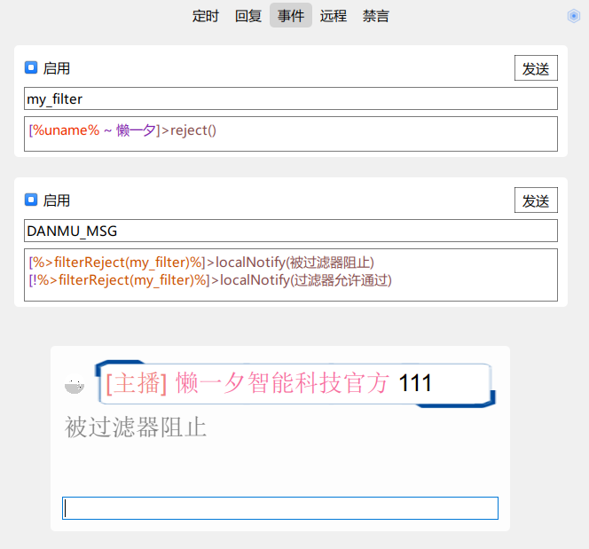
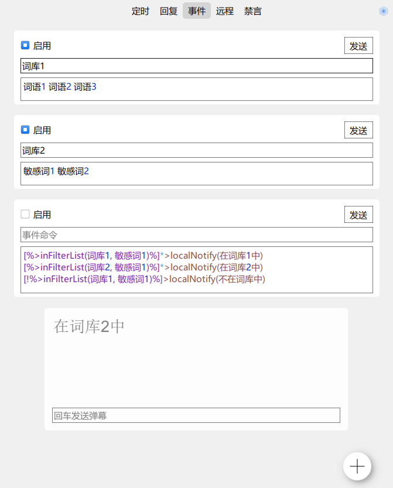
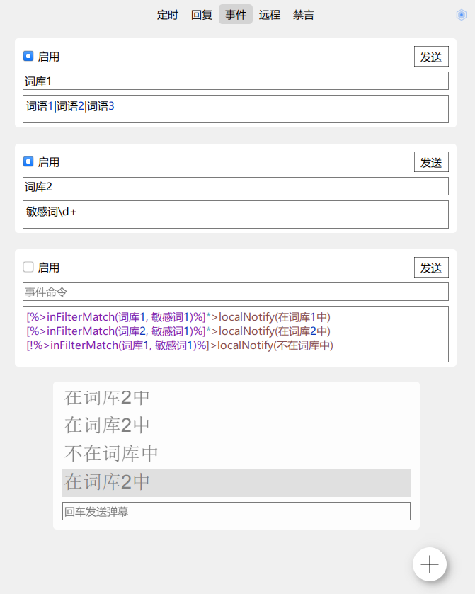

[toc]

神奇弹幕
========

## 简介

神奇弹幕以直播间为平台，利用网络通信技术、音视频技术、智能控制技术将直播有关的功能集成，构建高效的现代化播出环境与观众互动的管理系统，提升直播亲密性、便利性、艺术性，并提供全方位的信息交互功能。通过网络化综合智能控制和管理，实现“以人为本”的全新直播体验。

整合弹幕姬+答谢姬+点歌姬+回复姬+工作流(workflow)，支持弹幕聊天、观众互动、自动点歌、数据统计、私信处理等。最大的特点是可编程控制，自由制定规则，蕴含无限可能！

本程序以打造自动化直播间为主线，以建设高粘性粉丝团体为目标，坚持办好每一场直播、帮助每一名主播，保持观众互动，实现粉丝裂变，打造直播高峰，做有温度的直播助手。与此同时，规范观众行为秩序，促进直播产业健康有序发展，营造清朗的网络环境。

QQ群：**1038738410**，欢迎交流反馈与研究新功能~


## 神奇

- 主播秘书，一键上播下播、修改分区，直播数据收集与整理
- 根据约束条件（时间、等级、勋章等），按条件智能欢迎/答谢
- 外语自动翻译、AI闲聊回复、生僻字读音等自动化功能
- 粉丝变化、热门榜、大乱斗、船员变化、新人发言等种种数据
- 大乱斗查看双方串门的粉丝、同步视频PK对面消息、跑骚抓人
- 私信处理、感谢分享、最佳助攻、打卡回复、语音播报等
- 全自动点歌、弹幕切歌、自动暂停其它音乐、排队时长提示
- 点歌姬自动切换网易云/QQ/咪咕/酷狗，支持会员与本地导入
- 完全无人值守，远程控制，开播QQ群播报、自动录播
- 播放各音乐平台会员歌曲，没有版权的歌曲自动更换播放源
- 单个粉丝设置特别关心、强制提醒、专属昵称、永久禁言等
- 查看每名观众进来次数、礼物总计、弹幕记录、判断机器人等
- 弹幕语音播放与回复，百度/讯飞/微软语音等多个接口
- 小窗闲聊、迷你视频、快速截图，上班摸鱼挂后台听直播必备
- 自动签到、参与天选、领取小心心、赠送到期礼物
- 大量可编程运算、网页访问，超高自由度的弹幕机器人
- 游戏设计，比如扣1禁言、关注解禁、送礼物优先点歌等
- 更多神奇的隐藏功能，用户自己开发定制或者导入已有扩展

## 弹幕

### 答谢姬

- 自动欢迎进入
- 自动感谢送礼
- 实时感谢关注
- 冷却避免刷屏
- 合并礼物连击
- 设置礼物别名
- 智能昵称简化
- 目标强制欢迎
- 舰长单独欢迎
- 自动语音播报
- 个人专属昵称
- 开播下播提醒
- 可编程变量集
- 动态条件运算
- 黑白名单筛选
- 支持远程控制
- 支持语音朗读
- 礼物总结答谢
- 答谢分享直播间
- 答谢PK最佳助攻
- PK对面信息播报
- PK在线舰长播报
- PK连胜数量播报

### 弹幕姬

- 实时显示弹幕
- 小窗弹幕聊天
- 定时弹幕任务
- 简约聊天模式
- 点歌自动复制
- 查看点歌历史
- 保存弹幕历史
- 每日数据统计
- 外语自动翻译
- 智能沙雕回复
- 特别关心高亮
- 查看粉丝牌子
- 查看礼物价值
- 查看昵称拼音
- 粉丝变化提示
- 房管一键禁言
- 新人发言提示
- 弹幕自由复制
- 定时连接后台
- 喷子自动拉黑
- 新人快速禁言
- 跳转用户主页
- 用户累计数据
- 用户弹幕历史
- PK 历史次数
- 快速百度搜索
- 大乱斗的串门
- 对面消息同步
- 机器小号判断
- 弹幕语音朗读
- 支持讯飞语音
- 支持语音接口
- 弹幕全屏滚动
- 背景图片轮播
- 自动切换勋章
- 发送对面弹幕
- 显示船员数量
- 屏蔽用户进入
- 屏幕天选弹幕
- 发弹幕表情包

### 点歌姬

- 音源自动切换
- 播放会员歌曲
- 网易云ID点歌
- 点歌自动播放
- 智能匹配歌曲
- 暂停其余音乐
- 点歌历史记录
- 自由显示格式
- 自动点歌队列
- 点歌防止刷屏
- 关键词黑名单
- 伴奏优先播放
- 预计时长回复
- 支持弹幕切歌
- 送礼立即播放
- 背景封面模糊
- 提取主题色调
- 查看桌面歌词
- 收藏夹与历史
- 一键导入歌单
- 导入本地音乐

### 直播姬

- 修改房间标题
- 一键开播下播
- 切换直播分区
- 直播数据展示
- 实时人气查看
- 每日平均人气
- 一键任命房管

### 录播姬

- 自动开始录播
- 分割文件大小
- 断联自动重录

### 回复姬

- 自定义关键词
- 筛选用户条件
- 多条随机回复
- 支持编程变量
- 数量不做限制
- 用户弹幕打卡
- 远程控制程序
- 修改专属昵称
- 弹幕文字替换
- 每日天气预报
- 解析用户私信

### 视频流

- 匿名查看直播
- 预先连续截图
- 预览PK对面
- 避免PK黑屏
- 自动调整比例

### 截图制作

- 快速预先截图
- 多图片管理器
- 好图一键提取
- 截图批量裁剪
- 分解GIF动图
- 制作GIF动图
- 制作AVI视频
- 制作字符画图

### 服务端

- 直播姬可访问
- 无限扩展可能
- 支持B站接口

### 其他

- 开启大乱斗
- 全局快捷键
- 保存头像封面
- 配置导入导出
- 数据自动备份
- 投稿歌词字幕
- 自动切换勋章
- 每日自动签到
- 自动参与天选
- 赠送到期礼物
- 直播状态查询
- 直播匿名跑骚
- 捕捉黑听舰长

## 运行与升级

### 运行

绿色版，免安装，双击 `神奇弹幕.exe`打开。

退出从屏幕**右下角托盘的右键菜单**中退出。

### 升级

下载新版的**zip文件**，解压后将里面的文件复制，**覆盖**旧版的文件。

### 备份

复制整个安装文件夹即可，支持任意多开。

### 绿化

默认就是绿色版，无限多开，可放在U盘等移动介质上。

删掉程序同一目录下的“green_version”文件，即变成安装版，不同位置的神奇弹幕使用同一套数据。

## 预览截图


# 说明书

## 使用技巧

绿色版，开箱即用，输入房间号自动连接。

### 实时弹幕

实时弹幕支持如同聊天软件的水群小窗，`Shift+Alt+D`快速弹出（非隐藏时有效），ESC返回之前的程序。

右键菜单中有许多的操作，可自行研究。

若是上班摸鱼，可以设置闲聊模式（仅显示弹幕）+简约模式（去头像、彩色），背景全透明，文字半透明灰色，不注意绝对很难看出来。

### 设置账号Cookie

如果要发送弹幕，必须登录账号。目前有**二维码登录**和**手动设置Cookie**两种方式。

**方式一：二维码登录**

直接点开菜单中的“账号——二维码登录”，使用哔哩哔哩APP扫码确认。

**方式二：使用浏览器Cookie登录**

1. 浏览器上按 `F12`打开【开发者工具】，Network - XHR
2. 进入或刷新[B站主页](https://www.bilibili.com/)（没登录的需登录），Name多了一排，点其中任意一个（若找不到Cookie就换个）
3. 复制如下图的cookie至右上角登录账号的菜单中的“设置Cookie”，即可进行发送。


使用Cookie也是为了保证账号安全，当程序借给别人时，自己可以远程退出Bilibili账号，所有登录失效。之后则需要重新设置cookie。

> 如果输入房间号后一直显示“获取房间信息...”，需先安装VC_redist：https://aka.ms/vs/15/release/vc_redist.x64.exe

### 自定义变量

在“答谢”/“扩展”页的右上角按钮，点出“自定义变量”，添加当前主播的信息：

```
%upname%=小明
```

> 程序内置变量里的 `%up_name%` 会替换为主播的账号昵称，此处自定义的 `%upname%` 可以是完全不同的文字

代码中就可以使用 “欢迎%ai_name%来到%upname%的直播间~” 这样的格式。

### 语法说明

几处代码框（欢迎/礼物答谢/关注答谢/定时/回复/事件/禁言等）按照以下格式：

```
[必须满足条件1]*****(发送选项)弹幕内容1\n第二条弹幕\n第三条弹幕
[必须满足条件2]***(发送选项)弹幕内容2
[必须满足条件3]*(发送选项)弹幕内容3
```

各部分分别是：

- [条件](#逻辑运算)（带方括号）
- [优先级](#优先级)（星号，数量越多优先级越高）
- [发送选项](#发送选项)（带小括号）
- 弹幕内容

各部分**均可省略**，但是若加上，则**前后顺序不能换**，并且必须使用**英文符号**。

如果一个代码框内有多行，则随机发送一行。多条弹幕需要在同一行，并且使用 “\n” 分隔。

具体说明在下一大章，可点击上方超链接快速跳转。

### 欢迎弹幕

以下多项功能支持自定义弹幕、大量可编程变量，具体说明请参考下面的“[可编程设计](#可编程设计)”。

- 普通的欢迎：`%ai_name%，%greet%%tone/punc%`
  将发送：某某某，早上好啊~
- 欢迎**舰长**：`[%guard%]*欢迎%guard_name% %ai_name% 回家~`
- ~~一周至一个月没来~~：`[%come_time%>%timestamp%-3600*24*30, %come_time%<%timestamp%-3600*24*7, 0]*%ai_name%，太久没来了哦~`

  > v3.5.7修改：为了保证运行效率，一周没有进入直播间的用户记录将自动清除
  >
- **大乱斗对面**来人：`[%pk_opposite%]***欢迎%ai_name%串门哦~`

##### 示例：只欢迎戴自己勋章

未戴粉丝勋章或者不是本直播间粉丝勋章的用户，不自动欢迎；除非是舰长或设置为强提醒：

```
[%guard% = 0, %anchor_room_id%!=%room_id%, !%strong_notify%]**
```

两个 `*`表示优先级，覆盖没有 `*`或1个 `*`的弹幕，空弹幕表示不发送。

##### 示例：指定用户欢迎语

指定某一用户的进场通知：

```
[%uid%=12345678]***欢迎%ai_name%，说好的今天上总督呢~
[%uname%=用户昵称]***欢迎%ai_name%，今天记得上总督哦~
```

推荐使用UID的方式，不会变更；临时用可用uname。

其中表示优先级的 `*`数量务必要比其余弹幕多。

### 送礼答谢

- 普通的答谢：`谢谢 %ai_name% 的%gift_name%~`
- **小礼物**不理：`[%gift_gold%=0, %gift_silver%<1000, %gift_num% < 10]**`
  也可以写作：`[%coin_type%=0, %gift_coin%<1000, %gift_num% < 10]**`
  1000以下的银瓜子礼物且数量小于10，则忽略。例如忽略6个小心心，但24个小心心则感谢
- **超过80元**的礼物：`[%gift_gold%>=80000]*哇噢！感谢 %ai_name% 的%gift_name%！\n老板大气！！！！！！`
  `\n`表示换行，将分作两条弹幕发送（可以配合 `<h1>`放大字体，仅部分弹幕插件有效）
- **跳过机器人送的吃瓜**：`[%uid%=%my_uid%,%origin_gift_name%=吃瓜]**`

##### 示例：指定礼物专属答谢

赠送小电视飞船，发送指定弹幕：

```
[%gift_name%=小电视飞船]**哇！！！谢谢%ai_name%带大家上太空~
```

##### 示例：不答谢禁言用户

提升优先级，空弹幕，即屏蔽。

```
[%blocked%]****
```

### 关注答谢

##### 示例：特别关注

```
[%special%]*(cd21:0)谢谢%ai_name%的特别关注！
感谢 %ai_name% 的关注%punc%
```

> 测试时不答谢关注的一个重要原因，是因为刚取消关注就重新关注了，短期内不会答谢！

### 定时任务

定时发送随机弹幕、执行命令。

##### 示例：今日是否有大航海

```
[%today_guard%=0]今天XX等到新的舰长了吗？\n老板们救救可怜的XX吧~
[%today_guard%>0]今天XX等到了新的舰长，还有老板想上船嘛
```

> 今天的相关数据都需要在程序连接房间时才有效

##### 示例：定时联网

如果想要定时向某个API发送数据，可通过定时任务结合 `connectNet(url)`命令

```
>connectNet(要发送数据的网址)
```

##### 示例：定时监测屏幕内容

比较不同时候的屏幕显示内容是否一致。

添加保存的代码，需要手动点击发送：

```
>saveScreenShot(0, 100, 100, 200, 200, D:/test.png)
```

该代码会把矩形 `(100, 100, 200*200)` 这个范围的截图保存到 `D:/test.png` 的位置。

添加定时 1 秒，代码：

```
[%>compareScreenShot(0, 100, 100, 200, 200, D:/test.png)% == 100]*>localNotify(相同)

>localNotify(不相同，相似度：%>compareScreenShot(0, 100, 100, 200, 200, D:/test.png)%)
```

`%>compareScreenShot(0, 100, 100, 200, 200, D:/test.png)% == 100` 的意思是将当前 `(100, 100, 200*200)` 的截图**和之前保存的截图进行比较**。

如果显示内容没变，则会打印出“相同”的文字。相似程度从 0 到 100，按像素进行比较，0 为完全不同，100 为完全相同。

有多种算法，并且支持不同参数：

- 按 pixel（默认）：压缩到 8×8 大小后逐一按像素比较
  `compareScreenShot(screenId, x, y, w, h, path, pixel)`
  返回 0 ~ 100 整数的相似度，越高则越趋于相同。
- 按 pixel 与一定范围内的差值
  `compareScreenShot(screenId, x, y, w, h, path, pixel, threshold)` 其中 threshold 为 0 到 255 之间的整数，两张图相同位置的 R/G/B 差值在阈值内的视为同一个点。
  返回 0 ~ 100 整数的相似度，越高则越趋于相同。
- AHash
  `compareScreenShot(screenId, x, y, w, h, path, ahash)`
  返回 0 ~ 64 整数的相似度，一般当 >= 60 的时候可视为同一张图。
- DHash
  `compareScreenShot(screenId, x, y, w, h, path, dhash)`
  返回 0 ~ 64 整数的相似度，一般当 >= 60 的时候可视为同一张图。
- PHash
  `compareScreenShot(screenId, x, y, w, h, path, phash)`
  尚未实现

### 自动回复

接收到某个关键词，发送对应的回复。

关键词支持正则表达式，使用 `%$x%`来获取匹配到的文本，其中 `x`为索引，`%$0%`为接收的整条弹幕，`%$1%`为捕获的第一对括号中的文字，`%$2%`为第二对，下同。

##### 示例：关键词自动禁言

> 有专门的禁言选项卡，此示例仅仅是展示使用方式

添加需要禁言关键词 `xxx`，支持正则表达式。设置回复：

```
>block(%uid%)
```

##### 示例：房管远程弹幕禁言

默认仅主播与机器人账号支持弹幕禁言，此方法可提升至房管（或其他特定条件用户）：

添加回复：`^((禁言|解禁|解除禁言|取消禁言) .+|撤销禁言)$`，添加动作：

```
[%admin%]>execRemoteCommand(%text%)
```

##### 示例：不要欢迎我

添加表达式：`别这么热情`，添加回复：

```
>ignoreWelcome(%uid%)\n>已关闭您的自动欢迎
```

只要弹幕中包含“别这么热情”，则以后都不会自动欢迎

##### 示例：设置自己专属昵称

添加自动回复表达式：`^请?叫我\s+(.*)$`，添加回复：

```
>setLocalName(%uid%, %$1%)\n>设置您的专属昵称为：%$1%
```

当用户发送弹幕：“叫我 小明”或“请叫我 小明”，程序自动设置其专属昵称为“小明”。

可以使用 `%local_name%` 或者 `%ai_name%` 获取。

##### 示例：修改指定用户昵称

添加自动回复表达式：`叫(\S+)\s+(.*)`，添加回复：

```
[%admin%]>setLocalName(%(%$1%)%, %$2%)\n>修改专属昵称成功
```

### 浏览器插件

开启“扩展—网络服务”，之后于直播姬中添加浏览器并访问网址，即可打开插件页面，无缝嵌入直播界面。

网址为：`http://localhost:5520` + 路径。

目前支持以下功能：

| 说明                 | 路径                  |
| -------------------- | --------------------- |
| 点歌列表             | /music/index.html     |
| 正在播放的歌曲       | /music/playing.html   |
| 正在播放的歌曲的歌词 | /music/lyrics.html    |
| 送礼物小动画         | /gift/index.html      |
| 电影结束效果答谢     | /gift/end_thanks.html |

例如点歌列表，默认的链接是：

```
http://localhost:5520/music/index.html
```

更多功能可自行定制，接口与开发文档见底部“[Web开发接口](#web_dev)”。

### 远程控制

主播或者机器人账号在直播间内发送如 `关闭欢迎`、`开启录播`等命令，可远程控制在服务器上的机器人（本地没必要使用远程命令）。

- 关闭/开启功能：主开关
- 关闭/开启欢迎
- 关闭/开启关注答谢
- 关闭/开启送礼答谢
- 关闭/开启禁言：新人关键词自动禁言
- 关闭/开启点歌
- 关闭/开启点歌回复
- 关闭/开启定时任务
- 关闭/开启自动连接
- 关闭/开启弹幕回复：AI回复弹幕
- 关闭/开启录播
- 关闭/开启粉丝档案
- **禁言 [昵称] [小时]**：房管权限，根据[昵称]（允许一部分，根据弹幕记录自动倒找发言人）禁言某用户，[小时]可省略，默认为自动禁言的时长（禁言相关都需要在设置中开启“**启用禁言（主播/房管）**”），例如 `禁言 小明 3`，注意空格分隔
- 解禁 [昵称]：解除禁言，[昵称]支持用户名中的一部分
- **撤销禁言**：依次解禁最近禁言的用户
- 永久禁言 [昵称]：永久禁言某用户，可通过“解禁 [昵称]”、“撤销禁言”远程解除
- 关闭机器人：全局关闭（将无法远程唤醒）

### 弹幕样式

支持自定义实时弹幕的CSS样式，实时弹幕的右键菜单中，设置->标签样式。

**圆角矩形**

```css
background: white;
padding:5px;
border-radius: 10px;
```

**气泡图片**

```css
padding:10px;
border-image: url(:/bubbles/bubble1)
```

其中图片可使用本地绝对路径，例如：

```css
border-image: url(C:/Path/To/Image.png)
```

**类型选择**

支持按不同类型设置不同的样式，样式如下：

- msg：一些提示
- danmaku：弹幕（样式不影响左边头像显示）
- gift：送礼
- welcome：进入
- order-song：点歌提示文字：[点歌] 歌名
- guard-buy：开通/续费舰长
- welcome-guard：舰长进入
- attention：关注
- block：禁言
- share：分享直播间
- super-chat：醒目留言

以下是一个示例：

弹幕为默认气泡；礼物、上舰为圆角矩形卡片

```css
#danmaku {
    border-image: url(:/bubbles/bubble1);
    padding: 10px;
}
#gift, #guard-buy {
    background: #FFDAB9;
    padding: 5px;
    border-radius: 10px; 
}
```

### 多开与备份

#### 无限多开

本程序支持无限多开，在程序根目录下创建“green_version”文件，即是绿色版（默认），不同文件夹中的神奇弹幕使用不同的数据。删除文件夹时，程序及其使用数据将全部删除，不会留下痕迹。

若未设置成绿色版，则不同文件夹的神奇弹幕使用同一套数据，多开可能会有冲突。删除文件夹时，使用数据不会删除。此时升级很方便，新下载的安装包删除“green_version”即可恢复之前数据。

#### 自动备份、还原

每次启动的时候会将程序配置（settings.ini）和使用数值（heaps.ini）各加上当前时间备份至“backup/”文件夹，若不小心被其他版本覆盖，可将备份的这两个文件去掉文件名中的时间，放到程序根目录下。

#### 调试日志

如果经常遇见问题，请按以下方法开启日志：

在程序根目录的 `settings.ini` 文件中， `[runtime]` 分组下（没有则自己新建），添加 `debugToFile=true`。

重启神奇弹幕，根目录下会出现 `debug.log`，这就是调试日志。

**盘查问题时需要将这个文件交给开发者。**

## 可编程设计

通过一系列用户自由设计的代码规则，将工作分解成定义良好的任务，制定其触发条件和执行顺序，按照一定的规则和过程来执行这些任务，这就是工作流。

### 工作流的意义

直播间实施工作流管理所带来的好处是非常明显的，这包括提高直播间运营效率、改善人气资源利用、提高直播运作的灵活性和适应性、提高工作效率、集中精力处理弹幕聊天、跟踪观众互动过程、量化粉丝粘度、统计礼物数量，充分发挥现有直播数据的作用。实施工作流将达到缩短互动等待周期、改善弹幕流程、优化并合理利用资源、减少人为差错和延误、提高吸粉效率等目的。

总结可编程工作流带来的好处，可以归纳为以下几点：

1. 要处理的事项自动回复
2. 不需要对观众的数据进行手动整理
3. 主播只需要将精力集中在关心的互动上
4. 保存所有历史记录
5. 随时看到统计数据
6. 达到无纸化办公的目标
7. 完全支持分布式架构，多设备同时工作
8. 科学管理更近一层，直播效率明显提高
9. 直播间的核心竞争力将有所提升
10. 通过流程自动化与数据库集成，以及各类表单统计查询功能，提高决策能力

工作流的实现需要三个基本步骤：映射、建模和管理。映射是第一个步骤，其首要任务是确定直播间内全部现有的手工和自动化的业务流程；建模则是开发一个有助于与观众交互的模型。第三阶段是软件实施以及跨越多项业务逻辑的无缝系统集成。

为了确保工作流系统能够无缝地衔接到直播间中，用户必须遵从已经定义好的、经过实践确认的行之有效的**脚本规则**，并且在每个脚本都必须有可以度量的结果。在实际使用中，根据主播的情况来制定符合要求的脚本，在易用性和功能需求之间达到平衡。

### 简单介绍

弹幕的候选列表中，支持一系列的可编程变量、简单逻辑运算、简单算术运算。

使用两个 `%` 包括的英文，则为变量。数据变量例如 `%uname%`，与当前的一系列数据相关，例如礼物价值、今日人数等等；招呼变量例如 `%greet%`，**自动替换**为当前时间段对应的招呼语，例如候选项表达式 `%ai_name%，%greet%%tone/punc%`，在早上可能是“早上好啊，某某某”，在下午可能是“某某某，下午好\~”，在晚上又会是“晚饭吃了吗，某某某\~”。

示例：

- 简单的欢迎：`欢迎 %ai_name% 光临~`
- 动态语气词：`%ai_name%，%greet%%tone/punc%`

看下去，有更多例子。

如无特殊说明，下述代码的符号均以**英文符号**为准，如 `[]`、`()`、`,`，不支持中文的 `【】`、`（）`、`，` 等。

### 自定义变量

在“扩展”页面，右上角的菜单中选择“自定义变量”，在打开的对话框中设置自己需要的变量。

每一行使用“变量名 = 变量值”，所有代码块中的变量名都会替换为变量值。

一般来说，默认包含以下变量：

- `%upname%`：主播昵称

这些自带变量可能会在自带的代码中出现，请务必修改。

### 数据变量

同上，都需要带上百分号，例如 `%var%`，表格中皆省略。

目前已支持中文，可直接使用形如 `%用户ID%` 的格式。

| 变量             | 中文              | 说明                                                         |
| ---------------- | ----------------- | ------------------------------------------------------------ |
| uid              | 用户ID            | 是一串数字，确定唯一用户                                     |
| uname            | 用户昵称          | 需要用户值，例如定时消息，则只是空字符串                     |
| username         | 用户昵称          | 和上面一模一样                                               |
| nickname         | 用户昵称          | 同上                                                         |
| ai_name          | 用户智能昵称      | 优先专属昵称，其次简写昵称，无简写则用原昵称                 |
| local_name       | 用户专属昵称      | 实时弹幕中右键-设置专属昵称                                  |
| simple_name      | 用户简写昵称      | 去除前缀后缀各种字符                                         |
| room_id          | 直播间ID          |                                                              |
| room_name        | 直播间标题        |                                                              |
| up_uid           | 主播ID            |                                                              |
| up_uname         | 主播名字          |                                                              |
| my_uid           | 机器人ID          |                                                              |
| my_uname         | 机器人名字        |                                                              |
| csrf             | csrf              | 用户的csrf token                                             |
| level            | 用户等级          | 进入直播间没有level                                          |
| text             | 弹幕消息          | 若有换行，则替换为 `%n%`                                     |
| url_text         | URL编码的弹幕消息 | 针对弹幕消息进行URL编码，用于网址传参，避免一些特殊文本      |
| come_count       | 用户进入次数      | 长时间没来会被清空                                           |
| come_time        | 用户上次进入时间  | 10位时间戳，第一次进来是0；自动清理一周没来的。如果是串门回来，则是刚跑到对面串门的时间 |
| come_time_delta  | 进入时间差        | 当前时间 - 用户上次进入时间                                  |
| gift_id          | 礼物ID            | 盲盒是爆出来的礼物                                           |
| gift_gold        | 礼物金瓜子        | 非送礼答谢则没有，盲盒是原始价格                             |
| gift_silver      | 礼物银瓜子        |                                                              |
| gift_coin        | 礼物瓜子          | 不分金瓜子银瓜子                                             |
| coin_gold        | 是金瓜子礼物      | 金瓜子是1，银瓜子是0                                         |
| gift_name        | 礼物名字          | 如果设置了别名，则使用别名                                   |
| origin_gift_name | 礼物原始名字      | 未设置别名时等同于gift_name                                  |
| gift_num         | 礼物数量          |                                                              |
| gift_multi_num   | 带单位的礼物数量  | 如果为1个，则忽略，为空文本                                  |
| guard_buy        | 开通大航海        | 上船消息，gift_name：舰长/提督/总督；guard：3舰长/2提督/1总督 |
| guard_frist      | 初次上船          | 初次1，重新上船2，其余0                                      |
| total_gold       | 用户总共金瓜子    | 该用户一直以来赠送的所有金瓜子数量                           |
| total_silver     | 用户总共银瓜子    | 同上                                                         |
| anchor_room_id   | 粉丝勋章房间ID    | 进入、弹幕才有粉丝牌，送礼只能获取粉丝牌名字                 |
| medal_name       | 粉丝勋章名称      | 同上                                                         |
| medal_level      | 粉丝勋章等级      | 同上                                                         |
| medal_up         | 粉丝勋章主播昵称  | 只有弹幕消息有                                               |
| nickname_len     |                   | 用户昵称长度                                                 |
| giftname_len     |                   | 礼物名字长度                                                 |
| name_sum_len     |                   | 用户昵称长度+礼物名字长度                                    |
| ainame_sum_len   |                   | 用户短昵称长度+礼物名字长度                                  |
| danmu_longest    | 弹幕字数上限      | 当前账号的最长弹幕                                           |
| new_attention    | 新关注            | 最近50个关注内                                               |
| guard_buy_count  | 上船次数          | 舰长+1、提督+10、总督+100（只统计程序运行时），0为初次上船   |
| pking            | 大乱斗中          | 是：1，否：0                                                 |
| pk_video         | 视频大乱斗        | 是：1，否：0                                                 |
| pk_id            | 大乱斗编号        |                                                              |
| pk_room_id       | 对面房间号        | 未在PK中则为空，下同                                         |
| pk_uid           | 对面主播ID        |                                                              |
| pk_uname         | 对面主播昵称      |                                                              |
| pk_opposite      | 对面进入          | 需开启串门提示                                               |
| pk_view_return   | 去对面串门回来    | 需开启串门提示                                               |
| pk_count         | 匹配次数          | 未在PK中为0，下同                                            |
| pk_my_votes      | 己方积分          |                                                              |
| pk_match_votes   | 对方积分          |                                                              |
| area_id          | 分区ID            |                                                              |
| area_name        | 分区名字          |                                                              |
| parent_area_id   | 主分区ID          |                                                              |
| parent_area_name | 主分区名字        |                                                              |
| today_come       | 今日进入人次      | 每个人可能重复进入                                           |
| today_newbie_msg | 今日新人人数      |                                                              |
| today_danmaku    | 今日弹幕总数      |                                                              |
| today_fans       | 今日新增粉丝数    |                                                              |
| today_gold       | 今日金瓜子总数    |                                                              |
| today_silver     | 今日银瓜子总数    |                                                              |
| today_guard      | 今日上船人次      | 续多个月算多次                                               |
| today_max_ppl    | 今日最高人气      |                                                              |
| popularity       | 当前人气          |                                                              |
| guard_count      | 大航海人数        |                                                              |
| fans_count       | 总粉丝数          |                                                              |
| fans_club        | 总粉丝团          |                                                              |
| admin            | 房管              | 只有弹幕、进入才有                                           |
| guard            | 大航海级别        | 只有弹幕消息/购买舰长/舰长进入有；普通0，舰长3，提督2，总督1 |
| guard_name       | 大航海身份        | “舰长”/“提督”/“总督”，非船员为空                             |
| admin_or_guard   | 是否是房管或舰长  | 只有弹幕消息有，0或1                                         |
| online_rank      | 高能榜            | 返回高能榜排名，若不在高能榜上，则为0                        |
| vip              | 姥爷              | 同上                                                         |
| svip             | 年费姥爷          | 同上                                                         |
| uidentity        | 正式会员          | 同上                                                         |
| iphone           | 手机号认证        | 同上                                                         |
| number           | 数量              | 各种数量的通用写法，如礼物数量等                             |
| time_hour        | 当前小时          |                                                              |
| time_minute      | 当前分钟          |                                                              |
| time_second      | 当前秒            |                                                              |
| time_day         | 当前日期          |                                                              |
| time_month       | 当前月份          |                                                              |
| time_year        | 当前年份          |                                                              |
| time_day_week    | 当前星期          | 1~7                                                          |
| time_day_year    | 今年第几天        |                                                              |
| timestamp        | 当前时间戳        | 10位时间戳，可用于比较进入时间、多久没来等                   |
| timestamp13      | 当前时间戳13      | 13位时间戳                                                   |
| in_game_users    | 在游戏用户中      | uid在gameUsers[0]中（高性能，但重启清空）                    |
| in_game_numbers  | 在游戏数值中      | uid在gameNumbers[0]中                                        |
| in_game_texts    | 在游戏文本中      | text在gameTexts[0]中，空格等都需要一模一样                   |
| app_name         | 程序名字          | 返回exe名字（不带后缀），可用于多开区分                      |
| app_path         | 程序目录          | 数据路径，绿色版为安装目录                                   |
| www_path         | 网站目录          | 数据路径下的www目录的绝对路径                                |
| server_domain    | 网站域名          | 默认为 `http://localhost`                                    |
| server_port      | 网站端口          | 默认为 5520                                                  |
| server_url       | 网站网址          | 等于server_domain:server_port                                |
| living           | 直播中            | 直播：1，轮播：2，未开播：0                                  |
| is_up            | 是主播            |                                                              |
| is_me            | 是机器人          |                                                              |
| is_room_medal    | 戴本勋章          | 戴本直播间的粉丝勋章                                         |
| care             | 特别关心          | 是：1，否：0                                                 |
| strong_notify    | 强提醒            | 是：1，否：0                                                 |
| not_welcome      | 不自动欢迎        | 不欢迎：1，欢迎：0                                           |
| not_reply        | 不自动回复        | 是否是机器人发的弹幕，是：1，否：0                           |
| blocked          | 被禁言            | 禁言：1，未禁言0                                             |
| playing_song     | 当前歌曲          | 点歌姬没有播放歌曲则为空                                     |
| song_order_uname | 当前歌曲点歌者    | 同上                                                         |
| random100        | 随机100           | 1~100的随机数，同代码块中的都将随机替换为同一个数，可用于设置抽奖概率 |
| special          | 特别关注          | 关注答谢里可用，判断特别关注                                 |
| spread           | 推广方式          | 一般为空，可能是“星光推广”                                   |
| pk_magical_room  | 对面也用神奇弹幕  | 是：1，否：0                                                 |
| cd0~cd99         |                   | 冷却通道，等同于 `%>cd(X)%`                                  |
| wait0~wait99     |                   | 等待通道，等同于 `%>wait(X)%`                                |
| local_mode       | 本地模式          | 是：1，否：0                                                 |
| repeat_10        | 重复弹幕10        | 最后一条与最近10条弹幕是否重复，是：1，否：0                 |
| playing_tts      | 播放TTS           | 是否正在朗读弹幕/文字，是：1，否：0                          |
| mouse_x          | 鼠标X             | 获取当前鼠标的全局X坐标，相对于主屏幕左上角，若在左边副屏则 x 可能是负数 |
| mouse_y          | 鼠标Y             | 同上                                                         |

#### 特殊用法

##### 打破“仅直播时发送”

仅在 **定时任务、自动回复、事件动作** 中有效，在开启“**仅直播时回复**”开关后，下播后所有自动弹幕都将不发送。

此时在需要发送的弹幕框中，其 `任务/回复/动作`中带有 `%living%`选项，则在非直播时也会激活。

例如自动回复的动作为：`[%living%+1]弹幕文字`，该回复不受直播状态影响。

> 如果开启了“定时连接B站服务器”，那么超出时间段下播后神奇弹幕不会接收所有弹幕，所有功能暂停。

##### 自定义bilibili接口

`%csrf%`为用户cookie，用于连接B站的API，结合本程序的 `connectNet`(GET)、`postData`(POST)，向服务器发送指定数据。

### 招呼变量

| 变量      | 描述           | 示例                                              |
| --------- | -------------- | ------------------------------------------------- |
| hour      | 时辰           | 早上/中午/下午/晚上                               |
| greet     | 招呼           | 您好、早上好、晚上好                              |
| all_greet | 带语气词的招呼 | 你好、早上好啊、午饭吃了吗、晚上好呀、怎么还没睡~ |
| tone      | 语气词         | “啊”或“呀”                                    |
| lela      | 语气词         | “了”或“啦”                                    |
| punc      | 标点           | “~”或“！”                                     |
| tone/punc | 语气词或标点   | 上面两项，适用于和%greet%结合                     |

### 计算变量

| 变量     | 描述                | 注意事项                               |
| -------- | ------------------- | -------------------------------------- |
| %{key}%  | 获取配置文件中的值  | key为setValue(key)中的键值，未设置为空 |
| %[exp]%  | 简单的数值计算      | 暂时只支持加减乘除，不支持括号、小数   |
| %(name)% | 将用户昵称转换为uid | 需要实时弹幕上显示才有效，允许部分昵称 |

`%{key}%` 如果是一个未设置的值，那么将会是空字符串，如果要转化为数字 `0`，可以使用 `%[%{key}%+0]%`的方式。

支持默认值，格式为：`%{key|def}%`，如果key不存在，则会使用def的值，可以是数字或者任意字符串。

##### 示例：礼物价值

```
谢谢%ai_name%赠送了价值%[%gift_gold%/1000]%元的%gift_name%！
```

### 常量

| 常量 | 描述                                                                                                                                                                                              |
| ---- | ------------------------------------------------------------------------------------------------------------------------------------------------------------------------------------------------- |
| %n%  | 替换为换行符 `\n`，目前仅支持：`postData()`、`postJson()`、`writeTextFile()`、`appendFileLine()`、`sendToSockets()`、`sendToLastSocket()`、`runCommandLine()`、`sendLongText()` |

### 函数计算

按指定格式，获取动态的数值，格式：`%>func(args)%`

| 函数                                                        | 中文             | 描述                                                                                                                                                                                                            |
| ----------------------------------------------------------- | ---------------- | --------------------------------------------------------------------------------------------------------------------------------------------------------------------------------------------------------------- |
| cd(channel)                                                 | 冷却通道         | 获取冷却通道剩下的秒数                                                                                                                                                                                          |
| wait(channel)                                               | 等待通道         | 获取等待通道不是自己的弹幕数量                                                                                                                                                                                  |
| time(format)                                                | 格式化时间       | 当前时间转换为数值，如 yyyy-MM-dd                                                                                                                                                                               |
| unameToUid(uname)                                           | 查找用户名       | 由部分昵称倒找弹幕记录，获得UID                                                                                                                                                                                 |
| inputText(title, default)                                   | 输入文本         | 输入文本，两个参数都可省略                                                                                                                                                                                      |
| strlen(text)                                                | 取文本长度       | 一串文字的长度                                                                                                                                                                                                  |
| trim(text)                                                  | 删首尾空         | 去掉字符串首尾的空格和制表符                                                                                                                                                                                    |
| substr(text, left, length)                                  | 取子串           | 获取文字的一部分                                                                                                                                                                                                |
| simpleName(name)                                            | 昵称简化         |                                                                                                                                                                                                                 |
| simpleNum(number)                                           | 数值简化         |                                                                                                                                                                                                                 |
| inGameUsers(listId, uid)                                    | 在游戏用户中     | listId可省略。程序重启数据会清空                                                                                                                                                                                |
| inGameNumbers(listId, num)                                  | 在游戏数值中     | listId可省略，程序重启数据仍在                                                                                                                                                                                  |
| inGameTexts(listId, text)                                   | 在游戏文本中     | listId可省略，程序重启数据仍在                                                                                                                                                                                  |
| getValue(key, def)                                          | 取变量值         | 等同于 `%{key}%`，默认值def可省略                                                                                                                                                                             |
| random(min, max)                                            | 取随机数         | 包含两端数字                                                                                                                                                                                                    |
| randomArray(a, b, c, d...)                                  | 随机数组         | 任意多参数，随机返回其中一个                                                                                                                                                                                    |
| filterReject(filter)                                        | 过滤器拒绝       | 被对应filter拒绝则返回1,否则返回0（参考过滤器示例）                                                                                                                                                             |
| inFilterList(filter, content)                               | 在过滤列表中     | 包含在空格分隔的词库中则返回1（参考过滤器示例）                                                                                                                                                                 |
| inFilterMatch(filter, content)                              | 在过滤正则中     | 满足正则则返回1（参考过滤器示例）                                                                                                                                                                               |
| fileExists                                                  | 文件存在         | 有这个文件则返回1，否则0                                                                                                                                                                                        |
| abs(val)                                                    | 取绝对值         |                                                                                                                                                                                                                 |
| log2(val)                                                   | 取对数2          |                                                                                                                                                                                                                 |
| log10(val)                                                  | 取对数10         |                                                                                                                                                                                                                 |
| pow2(val)                                                   | 取平方           |                                                                                                                                                                                                                 |
| pow(val, a)                                                 | 取乘方           |                                                                                                                                                                                                                 |
| pasteText()                                                 | 粘贴文字         | 获取剪贴板的文本                                                                                                                                                                                                |
| getScreenPositionColor(wid, x, y)                           | 获取屏幕位置颜色 | wid为屏幕ID（一般为0），x y 为横纵坐标，返回例如 `#f0f0f0` 的颜色格式                                                                                                                                         |
| getWindowPositionColor(name, x, y)                          | 获取窗口位置颜色 | name 为窗口名字（可以是部分）或者句柄ID，不能是最小化窗口                                                                                                                                                       |
| execReplyResult(text)                                       | 执行回复结果     | 获取满足text的第一个回复的执行结果；结果中若存在命令则会执行，若有换行符“\n”则会返回用它分隔的单行文字                                                                                                        |
| execEventResult(event)                                      | 执行事件结果     | 获取指定事件的执行结果，重复则取第一个，同上                                                                                                                                                                    |
| readTextFile(fileName)                                      | 读取文本文件     | 读取文本文件中的所有内容，所有换行符 `\n` 将会被替换为 `%n%`                                                                                                                                                |
| getTextFileLine(fileName, line)                             | 获取文本文件行   | 读取文本文件中的第 line 行，行数从 1 开始                                                                                                                                                                       |
| getTextFileLineCount(fileName)                              | 获取文本文件行数 | 读取文本文件中的所有行数（以 `\n` 为准）                                                                                                                                                                      |
| compareScreenShot(screenId, x, y, w, h, path[, other args]) | 比较窗口截图     | 比较当前窗口的截图与指定图片文件的相似度。<br />screenId:屏幕ID，只有一个屏幕则为0；x/y/w/h:坐标与宽高；path:要比较的文件路径。<br />返回一个0到100的数字，表示相似程度。具体请参考[示例](#示例：定时监测屏幕内容) |
| getScreenWidth(screenId)                                    | 获取屏幕宽度     | 获取指定显示器的屏幕宽度。如果不指定屏幕ID，则默认为0                                                                                                                                                           |
| getScreenHeight(screenId)                                   | 获取屏幕高度     | 同上                                                                                                                                                                                                            |
| findWindow(窗口标题)                                        | 查找窗口         | 根据完整的窗口标题或类名来查找顶级窗口（不搜索子窗口），返回一个窗口句柄（hwnd），可用于作为修改窗口的命令的参数。结合 `spy++`工具来获取标题或类名                                                            |
| getForegroundWindow()                                       | 获取前景窗口     | 获取当前具有焦点的窗口的句柄（hwnd）                                                                                                                                                                            |
| isWindowFullScreen(hwnd)                                    | 窗口是否全屏     | 判断窗口是否全屏（不包含最大化），可用于判断游戏全屏、视频全屏                                                                                                                                                  |
| getCursorPos(x/y)                                           | 获取鼠标位置     | 获取当前鼠标的位置，参数为 x 或 y 字符串                                                                                                                                                                        |
| getWindowRect(hwnd, x/y/w/h)                                | 获取窗口位置     | 获取指定窗口几何坐标的值                                                                                                                                                                                        |
| getWindowFromPoint(x, y)                                    | 获取坐标所在窗口 | 获取屏幕上坐标为(x,y)的位置指向的最前面的窗口                                                                                                                                                                   |

以获取时间为例：

```
当前时间：%>time(yy-MM-dd hh:mm)%
```

### 四则运算

数字与数字、字符串与字符串之间可进行比较。其中运算符支持 `加+`、`减-`、`乘*`、`除/`(向下取整)、`取模%`、`包含~`，比较支持 `大于>`、`小于<`、`等于=`、`不等于!=`、`大于等于>=`、`小于等于<=`。

tips：

- 开发人员友好，`=` 可写作 `==`
- 不等于 `!=` 也可以是 `<>`
- 字符串两端可不用加双引号 `"`

比较的两边，当都是数字或算数表达式时，自动进行简单的计算（暂不支持复杂格式）。

另外，仅支持在开头的 `[]`判断中进行四则运算，**在弹幕内容中计算需要使用 `%[公式]%`**！

#### 数值修改延迟

所有变量的值都是在**触发的一瞬间赋值**的，如果在同一行中前面修改了某一值，那么后面的值也不会跟着修改。请看以下示例：

```
>setValue(count, %[%{count}%+1]%)\n数量：%{count}%
```

将数量count的大小加1并发送数量的弹幕，但显示的count是修改之前的大小。

应使用以下方式，计算两次：

```
>setValue(count, %[%{count}%+1]%)\n数量：%[%{count}%+1]%
```

另外，由于弹幕冷却时间，所有命令也不是瞬间执行完毕，会**按照一定的时间间隔依次执行**，可能会导致读取的时候前面命令还没写完。典型的例子就是**多个人同时打卡**，总次数只会增加一次（但不影响两个人的打卡天数、积分等）。

#### 语法糖

> V4.6.0 版本开始，新增一项开关：语法糖，默认开启。

如果要修改一个值，以前的版本是比较复杂的，例如将打开天数+1：

```
>setValue(data, %[%{daka}%+1]%)
```

而通过语法糖，则只需要简单的相加即可：

```
{daka}++
```

目前开启此项功能后，可支持以下语法糖：

- 赋值：`{var} = 20`，等同于 `>setValue(var, 20)`
- 加/减/乘/除/取模：`{var} += 10`，等同于 `>setValue(var, %[%{var}% + 10]%)`
- 自增/自减：`{var}++` 、`{var}--`，前者等同于 `>setValue(var, %[%{var}% + 1]%)`

### 逻辑运算

与编程语言相似的算法，每一行使用 `[]` 开头，则方括号中的内容会识别为 `条件表达式`，使用 `,` 或 `&&` 来执行“与”逻辑，使用 `;` 或 `||` 来执行“或”逻辑；“或”的优先级更高。`[]` 中使用 `%val%` 作为变量值，例如 `[%level%>10]弹幕内容`，则只有当用户等级超过10级时才会被发送 `弹幕内容`。

（V4.0.6新增）当条件表达式包含字符串或者正则表达式时，可能会出现**符号冲突**问题，使用双方括号 `[[条件]]` 或者三方括号 `[[[条件]]]` 来替换单方括号。

示例：

- 用户等级为0级：`[%level%=0]` 或 `[%level% == 0]`
- 粉丝牌等级介于10级到19级之间：`[%medal_level%>=10, %medal_level%<20]`
- 名字为某某某：`[%uname%=某某某]` 或 `["%nickname%"=="某某某"]`
- 现在是黑夜：`[%time_hour% > 17 || %time_hour% <= 6]`
- 带粉丝牌的0级号，或非0级号：`[%anchor_room_id%, %level%]`
- 付费两万（2千万金瓜子）的老板：`[%total_gold% >= 20000000]`
- 一小时内重新进入直播间：`[%come_time% > %timestamp%-3600]`
- 几周没来：`[%come_time%>%timestamp%-3600*24*30 &&  %come_time%<%timestamp%-3600*24*7]`
- 某个片哥名字匹配：`[[%text% ~ "[\u4e00-\u9fa5]+[\w]{3}[\u4e00-\u9fa5]+"]]>block(%uid%)`

### 优先级

文本框中内容支持多行，一行为一条候选项，随机发送一条。其中每一条都可以用星号 `*` 开头（若有条件表达式 `[exp]`，则 `*`位于表达式后面），星号数量越多，则优先级越高。高优先级候选应当带有条件，当满足条件时，发送该条弹幕，并无视掉所有更低优先级的候选。

带有优先级的候选项，会被更高优先级（更多星号）的候选项所覆盖。

例如：

```
感谢 %ai_name% 的%gift_name%，么么哒~
[%gift_gold%>=10000]感谢 %ai_name% 的%gift_name%，老板大气！
[%gift_gold%>=50000]*(cd15:3)哇塞！感谢 %ai_name% 的%gift_name%！\n老板大气！
[%gift_gold%>=150000]**(cd16:1)哇噢！感谢 %ai_name% 的%gift_name%！\n老板大气！！！！！！
```

注意星号，1、2无优先级，即使满足第2项的条件，也是随机发送前两项之一。3优先级超过1、2，因此当满足3的条件并且不满足4时，会发送第3项。而当4的条件满足时，其余更低优先级的候选项都被无视，只发送4。

另外，3、4加入了 `冷却通道`，表示不使用默认的送礼冷却。以4为例，改为冷却1秒，相当于强制发送（B站限制，最快1秒）。

- 当本次礼物的金瓜子总价少于1万时，发送第一项；
- 当本次礼物的金瓜子总价小于5万时，随机发送第一项、第二项；
- 当本次礼物金瓜子总价介于5万到15万时，发送第三项；
- 当本次礼物金瓜子总价超过15万时，发送第四项。

#### 高优先级被忽略情况

高优先级只是说明“**在当前情景下更适合**”，并不代表一定会发送这一条。

当这一条弹幕的字数超过了设置的“弹幕最长长度”，那么高优先级的弹幕会被忽略，转而发送低优先级的。

至于冷却通道，则不会影响优先级。当最高优先级的弹幕尚在冷却中时，不会发送弹幕。

### 注释

使用 `//` 作为注释符号，直至后面**行尾**或者**弹幕结束标记 `\n`**，在发送弹幕时将被忽略。

使用 `///` 作为显眼的注释说明，将会是高亮的颜色，而不是灰色。

也支持多条连续弹幕插入注释，如下：

```C++
// 单行注释，不会被发送
这是弹幕 // 弹幕后面的注释
第一条弹幕//中间的注释1\n第二条弹幕//中间的注释2\n第三条弹幕
```

### 软换行

在行尾使用 `\` 可拼接连续的两行，不影响发送内容，示例如下：

```
计算结果：%[1     \
			+2  \
			+3]%
```

### 多条弹幕

使用 `\n` 来分割过长弹幕，则会分多条弹幕发送，每次延时1.5s。通过此方式支持**执行多条命令**。

> 这是两个普通字符，并不是换行符。对于编程人员来说，相当于代码中两个反斜杠加字母n。

受于B站后台的限制，多条弹幕将调整为每隔1.5秒发送一次，数量无上限。

---

### 发送选项

在发送的弹幕前添加英文小括号，里面可包含一些设置项 `(option)`，设置弹幕发送这一瞬间的属性。

- 冷却通道（cd）：控制弹幕发送频率
- 等待通道（wait）：控制自己不连续发送弹幕
- 强制房管权限（admin）：向普通观众的弹幕开放部分权限

举个例子：

```
[某条件]***(cd20:5,wait12:5)欢迎xxx~
```

发送选项必须在条件、优先级后面，顺序不能变动。多个发送选项使用英文逗号隔开。

#### 与条件的区别

这里以冷却通道为例：

- 条件的方式：`[%cd20%>5]某弹幕`
- 选项的方式：`(%cd20%:5)某弹幕`

同样是判断冷却通道20号的时间有没有满5秒，当满5秒的时候，两者的行为是一致的，都将发送弹幕。

若没到5秒，两者也都不会发送弹幕，但是具体影响上会有一些区别：

- 条件：会判断其他行的弹幕会不会发送，如果可以，则发送出去；
- 选项：不会判断其他弹幕，直接不发送。

**条件用来判断发送哪些弹幕，选项用来控制弹幕发送频率**。

#### 强制房管权限

选项中添加 `admin` 参数即可，如：

```
[%medal_level% >= 30](admin)>triggerReply(某回复)
```

该选项是用来提升普通用户的权限，即使不是房管，也可以使用一些相同的权限。

此处设置的权限**仅用于代码块中的 `%admin%` 判断**，不影响具体房管身份以及其他权限。

此处设置的房管权限可通过 `>triggerReply()` 和 `>triggerEvent()` 传递到其他代码。

当然，也可以作为手动点“发送”按钮的一项调整。

### 冷却通道

> `v2.9.0`版本新增

为实现不同条件使用不同的冷却时间，新增了”冷却通道“的规则——连续发送弹幕（例如自动欢迎）会有一定冷却时间，但有时候会想要强制发送（例如强制欢迎舰长），或者自定义部分冷却时间（例如在有人连刷小心心的时候，突然有人上船，应当想要立刻通知）。

格式：`cd通道:冷却秒数`

在自定义弹幕的开头使用形如 `(cd25:10)`的格式，表示 `现在如果在上次发送的冷却通道25号的弹幕10秒之后，则发送当前弹幕`，即满足其10秒的冷却时间，并不受其他自动弹幕的影响。

##### 示例：强制欢迎

每30秒欢迎一次用户；而若有25级及以上粉丝牌的用户进来，立刻欢迎，除非连续两个25级及以上的用户在5秒内进来，则只欢迎前一人；若是舰长，同上，多条冷却通道之间互不影响。而25级舰长，根据舰长优先级 `**`超过25级优先级 `*`，会优先发送欢迎舰长的弹幕。

```
(cd10:30)欢迎%ai_name%~
[%medal_level%>=25]*(cd11:5)欢迎%ai_name%，请多多关照~
[%guard%]**(cd12:5)欢迎舰长%ai_name%回家！
```

内置100个冷却通道，其中 `0~9`已被系统使用，用户自定义建议为 `10~99`，应该够用了。

> 注意：B站连续发送弹幕的冷却时间为1秒，与本程序的弹幕冷却系统无关。

### 等待通道

针对指定某个通道的弹幕，机器人发送一条后，至少**等待他人的多少条弹幕**后才会重新发送这条弹幕；自己发送的弹幕不会包含在这“多少条弹幕”之后。

格式：`wait通道:弹幕数量`

通道与冷却通道一样，可选 0 ~ 99。不同的通道互不影响。

在程序一开始连接上直播间时，所有等待通道的值为 99，相当于 `waitX:99`，一般无影响。

如定时消息：

```
(wait12:3)某定时发送的弹幕
```

自动发送一条弹幕后，并且第一条和第二条弹幕之间至少有3条弹幕；不满足条件则不会发送出去。

> 因为有主播嫌弃机器人话多，专门加的功能。

##### 示例：不连续的定时弹幕

结合**条件**和**选项**，设置定时任务，机器人不连续发送两条弹幕：

```js
[%wait10% < 1]**** // 没有别人发弹幕时，自己不连续发弹幕
(wait10:0)喜欢%upname%的小伙伴可以动动小手点个关注~
(wait10:0)关注主播不迷路,主播带你上高速~
(wait10:0)喜欢主播的可以点点关注哦~
(wait10:0)赠送一个B坷拉，领取主播专属勋章哦~
```

通过条件 `%wait10% < 1` 先判断该等待通道能否发送，这样影响的是这一块代码中的所有弹幕；

至于 `(wait10:0)`，则只是标记这些弹幕的等待通道是 10，用于下一次的条件判断。

### 命令操作

有一些自定义的命令，如 `>block(123456)`，如下：

| 命令                                               | 中文             | 说明                                                         |
| -------------------------------------------------- | ---------------- | ------------------------------------------------------------ |
| abort()                                            | 终止             | 终止本流程后面弹幕                                           |
| block(uid, hour)                                   | 禁言             | 禁言用户，`uid` 可使用参数 `%uid%` 获得                      |
| block(uid)                                         | 禁言             | 同上，默认使用自动禁言的时间                                 |
| unblock(uid)                                       | 解禁             | 解除禁言                                                     |
| eternalBlock(uid, markname)                        | 永久禁言         | 永久禁言某用户（需保持程序在线），`markname`为标记名字（避免时间长了改名不知道） |
| appointAdmin(uid)                                  | 任命房管         | 任命用户为房管，仅主播可用                                   |
| dismissAdmin(uid)                                  | 撤销房管         | 取消用户的房管身份，仅主播可用                               |
| delay(msecond)                                     | 延时             | 延迟执行后面所有待执行的操作，单位毫秒                       |
| addGameUser(listId, uid)                           | 添加游戏用户     | 添加用户至游戏队列，listId从0到99，使用 `%>inGameUsers(listId, uid)%`判断在不在。**程序重启后清空**，长期保存可使用 `addGameNumbers` |
| addGameUser(uid)                                   | 添加游戏用户     | 同上，默认listId使用0，可使用 `[%in_game_users%]`快速判断    |
| removeGameUser(listId, uid)                        | 移除游戏用户     | 从游戏队列中移除用户                                         |
| removeGameUser(uid)                                | 移除游戏用户     | 同上，默认listId使用0                                        |
| addGameNumber(listId, uid)                         | 添加游戏数值     | 添加用户至游戏队列，listId从0到99，使用 `%>inGameNumbers(listId, uid)%`。 |
| addGameNumber(uid)                                 | 添加游戏数值     | 同上，默认listId使用0，可使用 `[%in_game_numbers%]`判断      |
| removeGameNumber(listId, uid)                      | 移除游戏数值     | 从游戏队列中移除数值                                         |
| removeGameNumber(uid)                              | 移除游戏数值     | 同上，默认listId使用0                                        |
| addGameText(listId, uid)                           | 添加游戏文本     | 添加用户至游戏队列，listId从0到99，使用 `%>inGameTexts(listId, uid)%`。 |
| addGameText(uid)                                   | 添加游戏文本     | 同上，默认listId使用0，可使用 `[%in_game_texts%]`判断        |
| removeGameText(listId, uid)                        | 移除游戏文本     | 从游戏队列中移除用户                                         |
| removeGameText(uid)                                | 移除游戏文本     | 同上，默认listId使用0                                        |
| showValueTable(caption, key, field1, field2, ....) | 显示值表格       | 显示多个值的表格，详见下方示例                               |
| sendGift(giftId, num)                              | 赠送礼物         | 赠送礼物，只支持 id 的方式                                   |
| execRemoteCommand(cmd)                             | 执行远程命令     | 执行远程控制（见下面）                                       |
| execRemoteCommand(cmd, 0)                          | 执行远程命令     | 执行远程控制，不发送回馈通知                                 |
| sendPrivateMsg(uid, msg)                           | 发送私信         | 向指定用户发送私信                                           |
| sendRoomMsg(roomId, msg)                           | 发送直播间弹幕   | 向指定直播间发送弹幕                                         |
| sendRoomEmoji(roomId, emojiId)                     | 发送直播间表情   | 向指定直播间发送表情                                         |
| sendEmoji(emojiId)                                 | 发送表情         | 上面命令的省略房号版                                         |
| showScreenDanmu(text)                              | 显示全屏弹幕     | 将text作为本地全屏移动的弹幕显示，受相关设置影响，需打开“全屏弹幕” |
| timerShot(msecond, msg)                            | 延迟发送         | 定时多少**毫秒**后发送弹幕msg（msg允许为另一命令，多个命令使用 `%m%` 分隔） |
| localNotify(msg)                                   | 本地通知         | 发送本地消息通知（非弹幕，只有自己看得到）                   |
| localNotify(uid, msg)                              | 本地通知         | 同上，带用户ID                                               |
| speakText(msg)                                     | 播放语音         | 朗读文本                                                     |
| speakTextSSML(ssml)                                | 播放语音SSML     | 使用微软语音来播放SSML文本（不能有换行）；需要配置API        |
| speakTextUrl(url)                                  | 播放语音URL      | 播放在线合成的语音                                           |
| setVoiceSpeaker(name)                              | 设置语音发音人   | 不同语音有不同的发音人，详细看程序说明                       |
| setVoiceSpeed(speed)                               | 设置语音音速     | 0~100                                                        |
| setVoicePitch(pitch)                               | 设置语音音调     | 0~100                                                        |
| setVoiceVolume(volume)                             | 设置语音音量     | 0~100                                                        |
| openUrl(url)                                       | 打开网址         | 浏览器打开网址                                               |
| connectNet(url)                                    | 连接网址         | 用于连接其他API，不管返回结果                                |
| getData(url, [callback])                           | get数据          | 后台连接网址（GET），返回JSON数据，callback详见“获取网络数据回调”示例。回调中的 `%text%` 为纯文本结果 |
| postData(url, data, [callback])                    | post数据         | 同上（POST）                                                 |
| postJson(url, data, [callback])                    | postJson         | 同上，以JSON格式发送（仅Content-Type区别）                   |
| postHeaderData(url, headers, data, [callback])     | post头数据       | 同上。headers多个之间用 `&`分隔，格式：header1=value1&header2=value2&header3=value3 |
| downloadFile(url, path, [callback])                | 下载文件         | 下载网络文件至本地，成功后触发自定义事件。回调中的 `%text%`为文件路径 |
| sendToSockets(cmd, data)                           | 发送至socket     | 发送给所有包含cmd的已连接的WebSocket，如果cmd为空，则发送给所有WebSocket |
| sendToLastSocket(cmd, data)                        | 发送至最后socket | 发送给最后连上的WebSocket，无视cmd（甚至没收到cmds也行）     |
| runCommandLine(cmd)                                | 运行命令行       | 运行操作系统的命令行                                         |
| startProgram                                       | 运行程序         | 打开外部程序（例如守护进程）                                 |
| setSetting                                         | 设置某项配置     | 等同于v3.7之前的setValue，已不建议使用                       |
| removeSetting                                      | 移除某项配置     | 同上                                                         |
| setValue(key, val)                                 | 设置值           | 保存值到配置文件，通过%{key}%获取，重启后仍在。默认保存在“heaps”分组下，使用“group/key”指定分组 |
| addValue(key, val)                                 | 添加值           | 在原先值的基础上，添加val大小                                |
| setValues(exp, val)                                | 批量设置值       | 批量修改**已有**的值，exp为正则表达式。不允许批量设置非默认分组（即不能带“/”） |
| addValues(exp, val)                                | 批量添加值       | 批量添加已有的值                                             |
| setValuesIf(exp, [condition], newVal)              | 批量设置值如果   | 按条件批量修改已有的值，`[condition]`同弹幕条件（带方括号），详见下方“批量修改配置” |
| addValuesIf(exp, [condition], delta)               | 批量添加值如果   | 按条件批量添加已有的值                                       |
| removeValue(key)                                   | 移除值           | 移除配置文件中的单个值                                       |
| removeValues(exp)                                  | 批量移除值       | 移除配置文件中的多个值（不允许带“/”），exp为正则表达式       |
| removeValuesIf(exp, [condition])                   | 批量移除值如果   | 按条件移除配置文件中的多个值                                 |
| openFile(path)                                     | 打开文件         | 打开文件                                                     |
| playSound(path)                                    | 播放声音         | 播放音频文件                                                 |
| improveMusic(username, order)                      | 提升点歌         | 点歌提前播放，order为提升的索引值                            |
| cutMusic(username)                                 | 切歌             | 切歌，仅限正在播放该用户自己点的歌时                         |
| cutMusic()                                         | 切歌             | 立即切歌，无论是谁点的                                       |
| addMusic(path/name)                                | 添加音乐         | 添加本地音乐（完整路径）或者自动搜索网络歌曲到播放列表       |
| playMusic()                                        | 播放音乐         | 播放点歌姬的音乐；若没有歌曲，尝试播放下一首                 |
| pauseMusic()                                       | 暂停音乐         | 暂停点歌姬的音乐                                             |
| toggleMusicState()                                 | 切换音乐状态     | 切换音乐的播放/暂停状态                                      |
| messageBox(text)                                   | 消息弹窗         | 弹窗提示                                                     |
| sendLongText(text)                                 | 发送长文本       | 发送长文本，自动分割成多条                                   |
| appendFileLine(fileName, format)                   | 添加文件行       | 追加一行文本保存至“程序目录/dirName/fileName”末尾，支持变量。可用于保存送礼记录、上船记录等 |
| insertFileAnchor(fileName, anchor, content)        | 插入文件锚点     | 插入文字至文件中的“anchor”前。可组建HTML的 `<table>` 内容    |
| writeTextFile(fileName, text)                      | 保存文本文件     | 写入文本至“程序目录/fileName”，允许相对/绝对路径。注意路径的一些问题，比如“C:\new\a.txt”中的“\n”会被当做换行，可以使用“C://new/a.txt”的形式代替 |
| removeFile(fileName)                               | 删除文件         | 删除文件“程序目录/fileName”                                  |
| removeTextFileLine(fileName, line)                 | 移除文本文件行   | 删除文本文件中的某一行，行号从1开始                          |
| modifyTextFileLine(fileName, line, newText)        | 修改文本文件行   | 修改文本文件中的某一行，行号从1开始                          |
| fileEachLine(fileName, startLine, code)            | 文件每一行       | 读取txt文件的每一行，执行code命令。fileName 可以是相对文件名、绝对文件路径。startLine 为从哪一行开始读，可忽略。code中多行弹幕/代码需要使用 `%n%`替换 `\n`，并且需要使用 `\%`来转义替换 `%`，例如 `\%text\%`。`\%number\%`获取行号（从1开始），`\%text\%`获取本行内容；会覆盖原有的这两个变量 |
| csvEachLine(fileName, startLine, code)             | CSV每一行        | 读取csv文件（表格）的每一行，同上。使用转义的 `%$数字%` 来获取这一行中的每列元素，如 `\%$2\%` 获取当前行第二列 |
| AIReply(text, maxLen)                              | AI回复           | 调用AI回复某文字，并直接以弹幕的形式发送。maxLen为长度上限，默认单条弹幕，超出则不回复 |
| AIChat(text, code)                                 | AI聊天           | 调用AI回复文字，若有结果则执行code代码，使用 `\%text\%` 来获取回复结果。具体调用哪个AI，由设置中的选项决定。如果是ChatGPT，UID固定为0 |
| TXChat(text, code)                                 | 腾讯AI聊天       | 调用腾讯AI闲聊，同上                                         |
| ChatGPT(uid, text, code)                           | GPT聊天          | 调用ChatGPT闲聊，同上。如果开启了“功能型GPT”，那么`%text%`会是对应的msg |
| ignoreWelcome(uid)                                 | 不自动欢迎       | 不自动欢迎某用户                                             |
| setLocalName(uid, name)                            | 设置专属昵称     | 设置用户专属昵称                                             |
| joinBattle(type)                                   | 开启大乱斗       | 开启大乱斗，1普通，2视频                                     |
| triggerEvent(event)                                | 触发事件         | 触发自定义事件，可在“事件动作”中响应；附带当前最近处理的数据。若有多个，都会触发 |
| triggerReply(msg)                                  | 触发自动回复     | 触发自动回复（未开启会被忽略），可作为有参数的方法进行传递。若有多个，都会触发；若未找到合适的回复动作，会报一个警告 |
| call(event, arg1, arg2...)                         | 调用             | 触发事件，可以传递若干个参数，使用 `%$1%`这样的指令来获取参数 |
| getReplyExecutionResult(msg)                       | 获取回复执行结果 | 获取**第一个**符合 `msg`弹幕的回复的执行结果，并返回最终**弹幕**的拼凑结果，使用 `%n%`连接（写入到文件时会替换为换行）。该回复的代码中的命令会被立刻执行；若没有相应的回复，返回空字符串 |
| getEventExecutionResult(event)                     | 获取事件执行结果 | 同上                                                         |
| setTimerTask(id, time)                             | 开启定时任务     | id为单行注释的文字，格式：//id。time：<-1时重置时间，=-1时关闭，=0时切换开关，=1时开启，>1时设置为对应秒数并重置时间（关闭的话不会开启）。不建议设置1秒，因为弹幕冷却2秒 |
| orderSong(songName, uname)                         | 点歌             | 自动点歌，uname可以为任意字符                                |
| addBannedWord(word, anchor)                        | 添加违禁词       | 在指定"\|anchor"处插入"\|word"                               |
| showCSV(filePath)                                  | 显示CSV          | 显示表格文件，自动判定编码                                   |
| simulateKeys(keys)                                 | 模拟按键         | 模拟例如“ctrl+a”等按键，不分大小写。加号使用“add”代替；不支持汉字等非键盘键位字符。可用 `0x70`这样的形式模拟Win的F1键等。 |
| simulatePressKeys(keys)                            | 模拟按下按键     | 同上                                                         |
| simulateReleaseKeys(keys)                          | 模拟松开按键     | 同上                                                         |
| simulateClick()                                    | 模拟点击         | 模拟鼠标左键点击                                             |
| simulateClick(x, y)                                | 模拟点击         | 移动到指定x,y点，再模拟单击                                  |
| simulateClickButton(flag)                          | 模拟点击按钮     | 模拟鼠标点击，flag为WIN API 中的mouse_event事件的DWORD参数，即鼠标事件的位或值。如6为左键单击，24为右键单击。可简写为 left、right、middle、x |
| simulateClickButton(flag, x, y)                    | 模拟点击按钮     | 移动到指定x,y点，再模拟各按键点击；flag同上                  |
| moveMouse(x, y)                                    | 移动鼠标         | 移动鼠标到指定x,y点                                          |
| moveMouse(dx, dy)                                  | 调整鼠标         | 移动鼠标，相对于现在的位置差                                 |
| execScript(path)                                   | 执行脚本         | 执行放在 `程序目录/control/`文件夹下的bat或者vbs脚本，或绝对路径 |
| copyText(text)                                     | 复制文字         | 把文字复制到剪贴板                                           |
| setRoomTitle                                       | 设置直播标题     | 主播设置直播间的大标题                                       |
| setRoomCover(path)                                 | 设置直播封面     | 主播设置直播间的封面图片，path为图片路径（不会裁剪，只是压缩上传） |
| setLocalMode(true/false)                           | 设置本地模式     | 可通过回复、定时等开关本地模式，不发送弹幕                   |
| reconnectRoom()                                    | 重新连接直播间   | 强制重连直播间                                               |
| connectRoom(roomId)                                | 连接直播间       | 切换到任意直播间，支持房间号或身份码                         |
| SQLExec                                            | SQL执行          | 需要开启数据库。执行SQL语句，如创建表格、插入记录            |
| SQLQuery                                           | SQL查询          | 需要开启数据库。执行SQL语句并显示查询结果，如查找弹幕记录    |
| saveScreenShot(screenId, x, y, w, h, path)         | 保存窗口截图     | 保存指定位置的窗口截图为本地图片。screenId:屏幕ID，只有一个屏幕则为0；x/y/w/h:坐标与宽高；path:要比较的文件路径 |
| showWindow(hwnd, state)                            | 显示窗口         | 将窗口置为指定状态，state: normal/min/max/hide/show          |
| sendWindowMessage(hwnd, text)                      | 发送窗口消息     | 向指定窗口发送文字类的消息，模拟文字输入，如社交软件聊天界面。需要输入框获取到焦点才能输入 |
| moveWindow(hwnd, x, y, w, h)                       | 移动窗口         | 移动窗口至指定的坐标和尺寸                                   |
| sendEmail(address, subject, body)                  | 发送邮件         | 使用设置的账户向指定邮件地址发送邮件                         |


在自动回复的每一条弹幕中使用符号 `>` 开头，紧接着 `func(arg...)` 格式，将执行命令，而不发送弹幕（若不是上述命令，将改为弹幕发送）。

> 注意：若要同时操作多个命令，可用 `\n` 隔开（相当于多条弹幕）

#### 批量修改配置

针对 `setValuesIf(exp, [condition], newVal)` 、`removeValuesIf(exp, [condition])` 这两个较为复杂的命令。

`exp`为正则表达式，将会操作所有key满足该表达式的配置。

**当且仅当在 `[condition]`中：**

- `_VALUE_`替换为当前遍历到的值(value)
- `_$x_`替换为exp正则捕获的文字，其中 `x=0`时为键(key)，`x>0`时为正则的捕获组，等同于自动回复中的 `%$x%`
- `_{key}_` 替换为读取配置文件，等同于正常情况下的 `%{key}%`

**当且仅当在 `newVal` 中：**

- `_[exp]_`替换为计算表达式（不支持外面再嵌套任意内容）

例如：

- 删除7天没来的用户记录：
  `removeValuesIf(not_come_(\d+), [_VALUE_>7])`
- 今日没签到的用户重置连续签到为0：
  `setValuesIf(signin_keep_(\d+), [!_{signin_today__$1_}_], 0)`
- 用户上船天数+1：
  `setValuesIf(guard_days_\d+, [1], _[_VALUE_+1]_)`

#### 显示值列表

`showValueTable(caption, key, field1, field2, field3...)`

显示一个对话框，列出所有需要的值。

`caption` 是最顶上的标题，支持变量。

`key` 为用来遍历的带有可变值的正则表达式，例如 `integral_(\d+)`，将会遍历所有使用 `setValue`存储的键满足这个表达式的数值。其中必须有带括号的捕获组形如 `(\d+)`作为**变化的源头**，用来影响所有 `field`的变化；而在各 `field` 中可以使用 `_KEY_` 或者 `_ID_` 来替换为该值。

`field` 允许多个，每个的格式为：`标题:键`，标题是表格的标题（第一行），键是用来读取响应设置的。标题及中间的冒号可忽略。用 `_KEY_` 或 `_ID_` 来替换为表达式中变化源。单个数字类型的 `field` 末尾允许用 `:<` 从小到大、`:>` 从大到小排序，详见下方示例。

在 `key`和 `field`中，可使用 `_counts/`、`_heaps/` 前缀来指定读取哪一个配置文件，`key`默认为 `_heaps`即用户自定义的配置；`field`默认跟随 `key`的配置。

其中，`_counts/`文件为 `安装目录/danmaku_counts/房号.ini`，自动保存每个直播间的数据，**不同直播间不共享**；`_heaps/`为 `安装目录/heaps.ini`，**所有直播间共享一套数据**。

##### 示例：显示所有用户积分

显示签到的用户ID、昵称、积分，按积分从大到小排序

> 在之前的默认签到代码中，未加上保存昵称，所以uname是空的

```
>showValueTable(积分查询, integral_(\d+), ID:"_ID_", 昵称:uname__ID_, 积分:integral__ID_:>)
```

假定某个用户 id 是 123456，那么通过 `integral_(\d+)` 遍历到 `integral_123456` ，则 `_ID_` 是 123456，通过这一行来获取后面的 `name_123456`、`integral_123456` 等的值。

##### 示例：显示所有打卡记录

```
>showValueTable(今天共第%[%{daka}%+0]%人打卡, daka_sum_(\d+), ID:"_ID_", 累计:daka_sum__ID_:>, 昵称:uname__ID_, 积分:integral__ID_, 连续:daka_keep__ID_, 本月:daka_month__ID_, 今日:daka_today__ID_)
```

##### 示例：显示用户总金瓜子

```
>showValueTable(氪金列表, _counts/gold/(\d+), ID:"_ID_", 金瓜子:gold/_ID_:>, 昵称:_heaps/uname__ID_)
```

#### 解析JSON：网络数据回调

三个联网命令：`getData`、`postData`、`postJson`，最后一个参数可带有一个“回调入口”。其实这是一个事件，添加该回调同名的事件，即可获取到联网返回的数据。

目前只支持JSON格式的返回数据，使用 `%.键1.键2.键3%`  这样的格式依次获取JSON对象的值，例如：

```json
{
    "data": {
        "room": {
            "roomname": "房间名字"
        },
        "anchor": {
            "uname": "名字",
        }
    }
}
```

其中的roomname获取方式：`%.data.room.roomname%`，uname获取方式：`%.data.anchor.uname%`

注意：如果替换出来的内容**包含换行**，一样会替换到代码中，将会导致弹幕姬出错！

**JSON容错处理**

> V4.0.4版本修改：当JSON对象**没有该键**或者**索引超出数组范围**时，默认还是原字符串（例如 `%.data.list.1000%`，原样发出）

如果要允许不存在的键或者超出范围的索引，可以在后面加上英文字符“?”，如：`%.data.list?.1000?%`，当没有list或者list数量不到1000时，会返回空白文本。“?”只影响单个键或者索引，例如若没有data，会原样返回 `%.data.list?.1000?%`，相当于报错。

这样的作用是，JSON的**某些键可能是从变量中获取**，需要**先解析变量**才能开始读取完整的JSON，而变量可能会出问题。

**该版本之前，默认允许错误，返回空白**。

##### 示例：获取主播信息

添加命令至回复、事件等任意一项，动作：

```
>getData(https://api.live.bilibili.com/xlive/web-room/v1/index/getInfoByRoom?room_id=%room_id%, RoomInfoCallBack)
```

再添加一项事件：`RoomInfoCallBack`，动作：

```
>localNotify(舰长数量：%.data.guard_info.count%，\
	粉丝数量：%.data.anchor_info.relation_info.attention%，\
	粉丝团：%.data.anchor_info.medal_info.fansclub%，\
	主播等级：%.data.anchor_info.live_info.level%)
```

#### 关于多线程安全性

一般情况下，处理弹幕的命令会有短暂的延迟，尽管程序已经做了一定的优化，但两条弹幕前后的操作必定不会连续，存在 2s 延迟（受限于平台发送弹幕的最短间隔），因此如果同时处理多条弹幕，可能会出现**数据丢失**问题。

典型情况，如多人同时打卡，增加一天打卡次数：

```
观众1：>setValue(daka, %[%{daka}+1]%)
观众2：>setValue(daka, %[%{daka}+1]%)
```

假设 `%{daka}% = 0`，那么 `%[%{daka}+1]% = 1` ，那么执行的命令有可能会变成：

```
观众1：>setValue(daka, 1)
观众2：>setValue(daka, 1)
```

虽然有两人打卡，但结束后 `daka` 的值依旧为 `1`，而不是 `2`。

修改方法：**使用 `>addValue(daka, 1)` 或者语法糖 `{daka}++` 来替代 `>setValue(daka, %[%{daka}+1]%)`**，更安全且简洁易懂！

```
观众1：>addValue(daka, 1)  ->  变成1
观众2：>addValue(daka, 1)  ->  变成2
```

#### 简单命令示例

##### 示例：自动打卡

添加定时任务，设置时间为 `86400` （一天秒数）

添加发送的文本：

```
>sendRoomMsg(直播间房号, 打卡)
```

例如：

```
>sendRoomMsg(123456, 打卡)
```

这个命令会在房号为“123456”的直播间发送弹幕“打卡”。

注意：需要**关闭“仅直播时发送”**，或加上条件 `[%living%+1]`（未开播也执行）

##### 示例：自定义朗读弹幕格式

默认的设置只支持朗读用户名和弹幕内容，不能自定义朗读的格式。

这样设置自定义朗读的格式，加上“某某说”：

添加回复：`(.+)`，表示接收所有弹幕（不包括机器人自动发的），

```
>speakText(%uname%说：%text%)
```

注意：需要关闭设置里的朗读弹幕，否则会重复播放 2 遍

##### 示例：禁言小游戏

扣1禁言、关注主播或赠送小心心解除禁言（需要房管或主播）

**回复**中添加一栏，**关键词**为 `^1$`，**回复**：

```
已自动禁言，赠送小心心或关注主播解禁\n>block(%uid%, 1)\n>addGameUser(%uid%)
```

这里执行了三个操作：

1. 回复
2. 禁言
3. 添加到游戏用户，等待解除禁言

**答谢 — 感谢送礼**中添加：

```
[%in_game_users%,%origin_gift_name%=小心心]***已解除禁言\n>unblock(%uid%)\n>removeGameUser(%uid%)
```

> 其中 `[...]***` 中的星号为优先级，保证数量超过其余弹幕即可。
>
> `%in_game_users%` 确保是扣 `1` 被禁言（因为禁言的时候添加到了游戏用户）的，而非被手动禁言的用户

**答谢 — 感谢关注**中添加：

```
[%in_game_users%]*已解除禁言\n>unblock(%uid%)\n>removeGameUser(%uid%)
```

> 实测已关注的，先取关再马上重新关注，收不到通知，需要等会儿再关注

在两个答谢中，执行了三个操作：

1. 回复
2. 解除禁言
3. 从游戏用户中移除，后续小心心不再触发该游戏，而是普通的答谢

##### 示例：上船自动私信

**答谢 — 感谢送礼**中添加：

```
[%guard_buy%,%guard_first%=1]感谢%ai_name%开通%gift_name%！\n>sendPrivateMsg(%uid%, 感谢开通大航海，可加入粉丝群：xxx)
```

`%guard_buy%` 判断是否是购买舰长的通知；`%guard_first%` 判断是否第一次上船，第一次=1，续船=0，掉船后重新上船=2。

也可用 `%guard_count%` 来读取上船的次数作为条件，`%guard_count%=0`表示第一次上船。

> `%guard_count%` 只计算本程序时运行时购买舰长的用户，每次舰长+1，提督+10，总督+100。

后续版本已添加 `FIRST_GUARD` 用户第一次上船事件，可直接使用。

##### 示例：送礼优先点歌

**答谢-感谢送礼**中添加：

```
[%gift_name%=喵娘]>improveSongOrder(%uname%,5)
```

赠送一个喵娘则提前5首歌播放。可将 `5`改为 `999`表示无限大，或者用 `%gift_gold% / 1000` 表示每1000金瓜子礼物可提前一首歌，如下：

```
[%gift_name%=喵娘]>improveSongOrder(%username%,%[%gift_gold%/1000]%)
```

##### 示例：弹幕切歌

房管可以切所有歌，普通观众只能切自己点的歌

自动回复添加**表达式**：`^切歌$`

设置动作：

```
[%admin%]*>cutOrderSong()
>cutOrderSong(%uname%)
```

##### 示例：远程开关AI弹幕回复

默认仅机器人和主播可远程控制，而其他人不行。通过此方法设置特定用户（例如舰长、房管）开关。

添加关键词表达式：`^开启AI回复$`

添加回复：

```
>execRemoteCommand(开启弹幕回复,0)\n>setValue(reply, 1)\n已开启AI弹幕回复，发送“关闭”结束
```

添加关键词表达式：`^关闭(AI回复)?$`（回复“关闭”两字即可，可不用全打）

添加回复：

```
[%guard%, %{reply}%]>execRemoteCommand(关闭弹幕回复)\n>setValue(reply, 0)
```

逐一说明：

- `>execRemoteCommand`：运行仅机器人和主播才能用的远程指令，参数2的 `0`表示不自动回复（因为有自定义的另一个回复，覆盖掉默认的）
- `\n`：多个指令或多条弹幕，用 `\n` 标记隔开
- `setValue(reply, 1)`：设置变量 `reply`的值为1，用来判断是否需要关闭
- `[%guard%, %{reply}%]`：舰长且 `reply`=1，若是则执行后面的，否则不做操作

##### 示例：远程添加违禁词

添加回复：`添加违禁词\s*(.+)`，动作：

```
[%admin%]>addBannedWord(%$1%,|more_ban)\n>已设置，再发将自动禁言
```

违禁词格式：

```
^[^不都]*(违禁词1|违禁词2|more_ban)
```

在接收到房管发的形如“添加违禁词 笨蛋”的弹幕时，会在 `|more_ban`的左边插入 `|笨蛋`。

#### 积分查看

添加下述代码到任意可执行的地方，定时/回复/事件 均可，需要查看时点击“发送”按钮。

##### 示例：所有用户积分

```
/// 显示所有用户积分
>showValueTable(积分查询, integral_(\d+), ID:"_ID_", 昵称:uname__ID_, 积分:integral__ID_:>, 动作:action__ID_, 坐骑:mount__ID_)
```

##### 示例：所有打卡记录

```
/// 显示所有打卡记录
>showValueTable(今天共第%[%{daka}%+0]%人打卡, daka_sum_(\d+), ID:"_ID_", 累计:daka_sum__ID_:>, 昵称:uname__ID_, 积分:integral__ID_, 连续:daka_keep__ID_, 本月:daka_month__ID_, 今日:daka_today__ID_)
```

### 事件动作

收到服务器CMD消息、一些程序的运行状态的改变，都会触发本程序中的“事件”。

部分数据可直接用 `%uid%`、`%uname%` 等变量获得，部分CMD未读取数据，返回为空。

大部分CMD等同于B站后台CMD，也有一些是自创的。可用事件CMD如下：

#### 主程序事件

| 事件                            | 说明                                                            |
| ------------------------------- | --------------------------------------------------------------- |
| START_UP                        | 程序启动完成                                                    |
| START_WORK                      | 开播后启动程序，或者程序启动后再开播                            |
| LOGIN_FINISHED                  | 连接直播间并登录账号后                                          |
| SHUT_DOWN                       | 程序关闭的一瞬间                                                |
| **REMOTE_BLOCK**          | 远程禁言，信息为最后一条弹幕                                    |
| **REMOTE_BLOCK_OVERRIDE** | 同上，但是会覆盖掉自带的禁言回复                                |
| FIND_USER_BY_UNAME              | `%>unameToUid(昵称)%`的结果，可能是送礼或弹幕数据             |
| SOCKET_MSG_RECEIVED             | 接收到网页程序的socket消息                                      |
| PLAY_SOUND_FINISHED             | `>playSound(path)`  播放音频文件结束，`%text%` 获取文件路径 |

##### 示例：远程禁言回复

`禁言 xxx`通过倒找弹幕发送人昵称的方法，通过弹幕禁言用户。其中所有属性同 `DANMU_MSG`，例如 `%uid%`、`%uname%`等。如果禁言对象是房管，那么将会禁言失败。

添加事件 `REMOTE_BLOCK_OVERRIDE`，添加动作：

```
[%uid%=%my_uid%]**>因为太帅无法被禁言
[%uid%=%up_uid%]**>已禁言主播（狗头保命）
[%admin%]*>无法禁言房管
>已禁言：%uname%
```

**注意：添加本事件，将会屏蔽系统自带的禁言回复**

#### 时间事件

| 事件            | 说明                             |
| --------------- | -------------------------------- |
| NEW_HOUR        | 每小时0分触发                    |
| NEW_DAY         | 每天0点0分触发                   |
| NEW_DAY_FIRST   | 每天0点或每天第一次启动          |
| DAY_END         | 每天23:59:30（剩半分钟处理任务） |
| NEW_MONTH       | 每月1号0点                       |
| NEW_MONTH_FIRST | 每月1号0点或每月第一次启动       |
| MONTH_END       | 每月最后一天23:59:30             |
| NEW_YEAR        | 每一年开始的0点                  |
| NEW_YEAR_FIRST  | 每年开始0点或每年第一次启动      |
| YEAR_END        | 每年最后一天23:59:30             |
| NEW_WEEK        | 每周一0点                        |
| NEW_WEEK_FIRST  | 每周一0点或每周第一次打开        |
| WEEK_END        | 每周结束                         |

> 如果想指定间隔准点发送，例如每15分钟，可在整点时开启时长为900秒的定时任务

`NEW_DAY`和 `NEW_DAY_FIRST`的异同：

同：

- 每天0点都会触发

异：

- `NEW_DAY`：如果神奇弹幕没开，那么第二天启动时**需要手动点**事件中对应的“发送”按钮
- `NEW_DAY_FIRST`：启动时会自动执行新的一天的操作

> 注意：v3.7.4版本之前，`NEW_DAY_FIRST`有 bug，每次启动都会触发

##### 示例：打卡计数

发送“签到”或“打卡”进行打卡，并回复第几个以及累计几天；每人每天只能打一次卡。

> 本处只做一个简单计数，建议使用下方的“高级打卡”示例

添加自动回复：`^(签到|打卡)$`，动作：

```
[%{daka_today_%uid%}%]*>您已打过卡
[%living%+1]>打卡成功，您是今天第%[%{daka}%+1]%个，累计%[%{daka_sum_%uid%}%+1]%天\n\
	>setValue(daka, %[%{daka}%+1]%)\n\
	>setValue(daka_today_%uid%, 1)\n\
	>setValue(daka_sum_%uid%, %[%{daka_sum_%uid%}%+1]%)
```

添加事件：`NEW_DAY`，动作：

```
[%living%+1]>removeValues(daka_today_\d+)\n>setValue(daka, 0)
```

`[%living%+1]` 是用来保证即使开启了“仅在直播时回复”也能发送回复的弹幕

##### 示例：高级打卡

在以上的打卡计数中，添加了：打卡查询、连续天数、每月累计天数、满足天数报告。

因数量较多，建议直接复制以下代码，使用“工具-菜单”中的“**粘贴代码片段**”一键添加。

```json
[
    {
        "anchor_key": "神奇弹幕:AutoReply",
        "enabled": true,
        "key": "^(签到|打卡)\\s*([\\(（].*|\\d+)?$",
        "reply": "/// 记录每位用户是第几个打卡以及累计天数\n[%{daka_today_%uid%}%]*>您已打过卡\n[%living%+1]>签到成功，您是今天第%[%{daka}%+1]%个，本月%[%{daka_month_%uid%}%+1]%天\\n\\\n\t>setValue(daka, %[%{daka}%+1]%)\\n\\\n\t>setValue(uname_%uid%, %uname%)\\n\\\n\t>setValue(daka_today_%uid%, 1)\\n\\\n\t>setValue(daka_sum_%uid%, %[%{daka_sum_%uid%}%+1]%)\\n\\\n\t>setValue(daka_month_%uid%, %[%{daka_month_%uid%}%+1]%)\\n\\\n\t>setValue(daka_keep_%uid%, %[%{daka_keep_%uid%}%+1]%)\\n\\\n\t>setValue(integral_%uid%, %[%{integral_%uid%}%+1000]%)\\n\\\n\t>triggerEvent(DAKA_MONTH_%[%{daka_month_%uid%}%+1]%)"
    },
    {
        "anchor_key": "神奇弹幕:AutoReply",
        "enabled": true,
        "key": "^(查询(打卡|签到)|(打卡|签到)查询)$",
        "reply": "[%living%+1]连续%[%{daka_keep_%uid%}%]%天，本月%[%{daka_month_%uid%}%]%天，累计%[%{daka_sum_%uid%}%]%天"
    },
    {
        "action": "/// 重置每天打卡的人数\n[%living%+1]>setValue(daka, 0)\\n\\ // 重置今日打卡人数\n\t>removeValuesIf(^daka_keep_(\\d+)$, [!_{daka_today__$1_}_])\\n\\ // 未连续签到断开\n\t>removeValues(daka_today_\\d+) // 重置每人是否打卡",
        "anchor_key": "神奇弹幕:EventAction",
        "enabled": true,
        "event": "NEW_DAY_FIRST"
    },
    {
        "action": "/// 重置每月打卡天数\n[%living%+1]>setValues(daka_month_\\d+, 0)",
        "anchor_key": "神奇弹幕:EventAction",
        "enabled": true,
        "event": "NEW_MONTH_FIRST"
    },
    {
        "action": "您已打卡满21天，可找主播领小礼物~",
        "anchor_key": "神奇弹幕:EventAction",
        "enabled": true,
        "event": "DAKA_MONTH_21"
    }
]
```

#### 点歌姬事件

`%uname%` 点歌的用户，`%text%` 歌曲名字

| 事件                        | 说明                                                                                                                   |
| --------------------------- | ---------------------------------------------------------------------------------------------------------------------- |
| ORDER_SONG_SUCCEED          | 点歌成功，`%text%`获取歌名，`%prev_time%`获取几秒钟后播放，`%first%`获取第几首播放，`%.addBy%`获取点歌用户昵称 |
| ORDER_SONG_SUCCEED_OVERRIDE | 同上，但是会**覆盖掉**自带的点歌成功回复                                                                         |
| ORDER_SONG_PLAY             | 点歌开始播放，`%text%`歌名，`%uname%`点歌的用户名，`%come_time%`点歌时间戳(秒)                                   |
| ORDER_SONG_NOT_FOUND        | 点歌未找到，`%text%`获取搜索词                                                                                       |
| ORDER_SONG_FREQUENCY        | 点歌过于频繁                                                                                                           |
| ORDER_SONG_NO_MEDAL         | 点歌未戴勋章                                                                                                           |
| ORDER_SONG_NO_COPYRIGHT     | 点歌的所有音源都无法播放时触发                                                                                         |
| ORDER_SONG_COPY             | 点歌已复制歌名                                                                                                         |
| ORDER_SONG_IMPROVED         | 播放顺序提前，`%number%`获取当前顺序，从1开始，1为下一首                                                             |
| ORDER_SONG_CUTTED           | 被手动切歌，即调用 `>cutOrderSong`                                                                                   |
| SONG_PLAY_FINISHED          | 歌曲播放结束事件，`%.addBy%` 不为空表示是点歌                                                                        |
| CURRENT_SONG_CHANGED        | 歌曲开始播放(包括手动播放的)或播放列表结束。                                                                           |
| ORDER_SONG_BLOCKED          | 点歌由于关键词被阻止，`%{.key}%`获取关键词                                                                           |

可用歌名 `[%text%=""]` 判断歌曲是否有效， `["%uname%"=""]` 判断是在点歌姬中手动搜索添加的歌曲还是弹幕点歌的歌曲。

##### 示例：点歌提示未带勋章

添加事件：`ORDER_SONG_NO_MEDAL`，动作：

```
(cd35:600)请戴粉丝牌点歌
```

加了**冷却通道**，最多十分钟提醒一次。

##### 示例：点歌后立即切歌

在播放随机音乐时，用户点歌则立即播放。若已在播放其他用户点的歌，则无效。

添加点歌成功事件：`ORDER_SONG_SUCCEED`，动作：

```C++
["%playing_song%" != "", "%song_order_uname%" = ""]>cutOrderSong()
```

#### 弹幕事件

其中加粗事件表示程序中默认已用上（允许重复使用），并且能获得详细用户ID、昵称、粉丝勋章等信息。

未加粗事件则只是接收数据，未进行解析。

| 事件                          | 说明                                                                                                                  |
| ----------------------------- | --------------------------------------------------------------------------------------------------------------------- |
| **LIVE**                | 开播【欢迎语】                                                                                                        |
| **PREPARING**           | 下播【结束语】                                                                                                        |
| ROOM_CHANGE                   | 房间信息改变                                                                                                          |
| ROOM_RANK                     | 排名改变                                                                                                              |
| **DANMU_MSG**           | 接收到弹幕【自动回复】                                                                                                |
| **SEND_GIFT**           | 有人送礼【答谢送礼】                                                                                                  |
| WELCOME_GUARD                 | 舰长进入（不会触发）                                                                                                  |
| **ENTRY_EFFECT**        | 舰长、高能榜、老爷进入【欢迎舰长】                                                                                    |
| WELCOME                       | 老爷进入                                                                                                              |
| **INTERACT_WORD**       | 用户进入【欢迎】                                                                                                      |
| **ATTENTION**           | 用户关注【答谢关注】                                                                                                  |
| **SHARE**               | 用户分享直播间                                                                                                        |
| SPECIAL_ATTENTION             | 特别关注直播间，可用 `%special%`判断                                                                                |
| ROOM_REAL_TIME_MESSAGE_UPDATE | 粉丝数量改变                                                                                                          |
| SUPER_CHAT_MESSAGE            | 醒目留言                                                                                                              |
| SUPER_CHAT_MESSAGE_JPN        | 醒目留言日文翻译                                                                                                      |
| SUPER_CHAT_MESSAGE_DELETE     | 删除醒目留言                                                                                                          |
| SPECIAL_GIFT                  | 节奏风暴/定制的专属礼物                                                                                                 |
| **ROOM_BLOCK_MSG**      | 用户被禁言，`%uname%`昵称                                                                                           |
| **GUARD_BUY**           | 有人上船                                                                                                              |
| FIRST_GUARD                   | 用户初次上船                                                                                                          |
| NEW_GUARD_COUNT               | 船员数量改变事件，`%uname%`新船员昵称，`%num%`获取大航海数量，附带直播间信息json数据                              |
| USER_TOAST_MSG                | 上船附带的通知                                                                                                        |
| HOT_RANK_CHANGED              | 热门榜排名改变                                                                                                        |
| HOT_RANK_SETTLEMENT           | 荣登热门榜topX                                                                                                        |
| HOT_RANK                      | 热门榜xx榜topX，%text%获取排名                                                                                        |
| ONLINE_RANK_V2                | 礼物榜（高能榜）刷新                                                                                                  |
| ONLINE_RANK_TOP3              | 高能榜TOP3改变                                                                                                        |
| ONLINE_RANK_COUNT             | 高能榜改变                                                                                                            |
| NOTICE_MSG                    | 上船等带的通知                                                                                                        |
| COMBO_SEND                    | 礼物连击                                                                                                              |
| ANCHOR_LOT_CHECKSTATUS        | 天选时刻前的审核                                                                                                      |
| ANCHOR_LOT_START              | 开启天选                                                                                                              |
| ANCHOR_LOT_END                | 天选结束                                                                                                              |
| ANCHOR_LOT_AWARD              | 天选结果推送                                                                                                          |
| VOICE_JOIN_ROOM_COUNT_INFO    | 申请连麦队列变化                                                                                                      |
| VOICE_JOIN_LIST               | 连麦申请、取消连麦申请                                                                                                |
| VOICE_JOIN_STATUS             | 开始连麦、结束连麦                                                                                                    |
| WARNING                       | 被警告，`%text%`可获取内容                                                                                          |
| CUT_OFF                       | 被超管切断                                                                                                            |
| room_admin_entrance           | 设置房管                                                                                                              |
| ROOM_ADMINS                   | 房管数量改变                                                                                                          |
| MEDAL_UPGRADE                 | 勋章升级，仅送礼物后触发，需设置中开启“监听勋章升级”。`%medal_level%`获取新等级（但用户当前勋章不一定是本直播间） |

> 考虑到发送弹幕的限制，如果同一个事件添加多条弹幕，那么会按队列顺序发送，而不会一口气发完。
>
> 并且有冷却（默认2秒左右），可以在开头加上冷却通道例如 `(cd78:0)`消除冷却
>
> 另外，需注意 `PREPARE`，若开启了“仅直播时回复”，那么大部分动作（包括弹幕、命令等）将不会执行，可在下播结束语中操作

##### 示例：复读机

指定某一位用户的弹幕，重复其弹幕

添加事件：`DANMU_MSG`，动作：

```
[%uname%=用户昵称]%text%
```

##### 示例：QQ群推送开播消息

支持可通过网络访问的任意机器人接口。

以酷推为例：[https://cp.xuthus.cc](https://cp.xuthus.cc)，按其说明配置

添加开播事件：`LIVE`，动作：

```
>connectNet(https://push.xuthus.cc/group/[skey]?c=[开播消息])
```

其中 `[skey]`为您的酷推Skey，`[开播消息]`按服务格式自定义

一切配置妥当，开播时将会自动发送消息至QQ群。

##### 示例：下播自动关机

下播30秒后电脑自动关机

添加下播事件：`PREPARE`，动作：

```
>timerShot(30000, >runCommandLine(shutdown -s -t 30))
```

添加开播事件：`LIVE`，动作：

```
>runCommandLine(shutdown -a)
```

多了延时30秒和响应开播事件，是排除主播意外掉线的情况。

##### 示例：感谢分享直播间

添加分享事件：`SHARE`

添加弹幕动作：

```
感谢%ai_name%分享%upname%的直播间！
```

其中 `%upname%`可以使用菜单中的“自定义变量”来统一设置，也可以固定写死。

##### 示例：上船声音提示

添加事件：`GUARD_BUY`，动作：

```
>playSound(%app_path%/audios/guard.mp3)
```

有人上船则自动播放 `安装目录/audios/guard.mp3`，本程序不自带，需要自己找音频文件放上去。也可以是安装目录之外的绝对路径。

##### 示例：上船自动设置房管

需要主播登录，添加事件：`FIRST_GUARD`，动作：

```
>postData(https://api.live.bilibili.com/live_user/v1/RoomAdmin/add, admin=%uid%&anchor_id=%room_id%&csrf_token=%csrf%&csrf=%csrf%&visit_id=)
```

##### 示例：成为第x位船长

事件中添加事件：`NEW_GUARD_COUNT`，动作：

```
恭喜%uname%成为第%number%位船员！
```

##### 示例：恭喜勋章升级

需要在设置中开启“监听勋章升级”，否则不会一直刷新勋章。

送完礼物后勋章升级（仅送礼，**不包括**上船、每天第一条弹幕）

添加事件 `MEDAL_UPGRADE`，动作：

```
[%medal_level%>=5, %anchor_room_id%=%room_id%]恭喜%ai_name%勋章升级至%medal_level%~
```

注意：用户此时佩戴的粉丝勋章（即 `%anchor_room_id%`）不一定是当前直播间的，所以要判断一遍。

##### 示例：天选时刻中奖播报

添加事件：`ANCHOR_LOT_AWARD`，动作：

```
恭喜%uname%中奖：%text%
```

##### 示例：保存弹幕/送礼记录

保存弹幕记录到 “mydir/danmu.txt”：
事件：`DANMU_MSG`
动作：`>appendFileLine(mydir/danmu.txt, %uname%: %text%)`

保存送礼记录到“mydir/gift.txt”：
事件：`SEND_GIFT`
动作：`>appendFileLine(mydir/gift.txt, %gift_name% %number% %uname%)`

#### 大乱斗事件

| 事件                            | 说明                                                                                                               |
| ------------------------------- | ------------------------------------------------------------------------------------------------------------------ |
| PK_BATTLE_PRE                   | 大乱斗准备，10秒后开始                                                                                             |
| PK_BATTLE_SETTLE                |                                                                                                                    |
| PK_BATTLE_START                 | 大乱斗开始                                                                                                         |
| PK_BATTLE_PROCESS               | 大乱斗双方送礼                                                                                                     |
| **PK_ENDING**             | 大乱斗尾声，最后几秒                                                                                               |
| PK_BATTLE_END                   | 大乱斗结束                                                                                                         |
| **PK_END**                | %level%判断胜负，-1输，0平，1赢，可用来计算连胜                                                                    |
| PK_BATTLE_SETTLE_USER           |                                                                                                                    |
| PK_BATTLE_SETTLE_V2             |                                                                                                                    |
| PK_LOTTERY_START                | 大乱斗胜利后的抽奖                                                                                                 |
| **PK_BEST_UNAME**         | PK最佳助攻，%uname%昵称；%level%:1赢,0平,-1输；%gift_coin%总积分(=金瓜子/100)                                      |
| **CALL_ON_OPPOSITE**      | 本直播间的观众跑去对面串门                                                                                         |
| **ATTENTION_OPPOSITE**    | 本直播间观众关注了对面主播                                                                                         |
| **SHARE_OPPOSITE**        | 本直播间观众分享了对面直播间                                                                                       |
| **ATTENTION_ON_OPPOSITE** | 对面观众关注了本直播间                                                                                             |
| PK_MATCH_INFO                   | 获取对面直播间信息，详见“大乱斗匹配信息”示例，%gift_coin%获取高能榜总积分(=金瓜子数/100)，%number%获取高能榜人数 |
| PK_MATCH_ONLINE_GUARD           | 获取对面直播间舰长在线人数，详见“对面在线舰长播报”示例                                                           |
| PK_WINNING_STREAK               | 大乱斗连胜事件，%number%获取次数，至少为2                                                                          |

##### 示例：大乱斗结束前提醒

大乱斗结束前30秒提醒：一次大乱斗为5分钟，开始后4分半发送弹幕，270秒=270000毫秒。

添加事件：`PK_BATTLE_START`，动作：

```
>timerShot(270000, 离大乱斗结束还有30秒)
```

##### 示例：大乱斗蹭积分卡

添加事件：`PK_BATTLE_PRE`，动作：

```
>setValue(pk_ceng, 0)
```

添加事件：`SEND_GIFT`，动作：

```
[%pking%, %{pk_ceng}%=0, %gift_gold% >= 100000, %gift_num%=1]>setValue(pk_ceng, 1)\n>sendGift(20004, 1)
```

添加事件：`PK_BATTLE_END`，动作：

```
[%{pk_ceng}%=0]>setValue(pk_ceng, 1)\n>postData(https://api.live.bilibili.com/xlive/lottery-interface/v2/pk/join, id=%pk_id%&roomid=%room_id%&type=pk&csrf_token=%csrf%&csrf=%csrf%&visit_id=)
```

##### 示例：大乱斗最佳助攻

添加事件：`PK_BEST_UNAME`，动作：

```
[%level%>0, %gift_coin% >= 100]感谢本场最佳助攻：%uname%
```

仅当赢了，并且本次累计送礼有超过100积分（10000金瓜子）才感谢

##### 示例：大乱斗尊严票

对面超过100积分（1万金瓜子）而自己还是0积分的时候，送一个吃瓜保尊严 ╮(╯﹏╰）╭。

添加大乱斗即将结束事件：`PK_ENDING`

此事件的时间为大乱斗结束前3秒左右。

添加动作：

```
[%pk_my_votes%=0, %pk_match_votes%>100]>sendGift(20004, 1)
```

`20004` 为吃瓜的礼物ID，1为数量

##### 示例：自动开启大乱斗

每次结束后5秒，自动重新开始大乱斗的匹配。

事件：`PK_BATTLE_SETTLE`，动作：

```
>timerShot(5000, >joinBattle(1))
```

其中 `1`为普通大乱斗，`2`为视频大乱斗。

仅支持 obs，**使用直播姬的主播无效**。

第一次大乱斗需手动点“发送”开启。

##### 示例：主播互相串门

对面主播过来串门时，自己也过去发弹幕。

添加事件：`INTERACT_WORD`，动作：

```
[%pking%, %uid%=%pk_uid%]>sendRoomMsg(%pk_room_id%, 我也来串门啦~)
```

##### 示例：大乱斗匹配信息

添加事件：`PK_MATCH_INFO`，将在大乱斗开始的时候，获取对面直播间的信息。

可参考 `https://api.live.bilibili.com/xlive/web-room/v1/index/getInfoByRoom?room_id=您的房间ID` 的结果，其 `data` 中的值。

例如：

- 主播名称：`%.anchor_info.base_info.uname%`
- 勋章名称：`%.anchor_info.medal_info.medal_name%`
- 舰长数量：`%.guard_info.count%`
- 粉丝数量：`%.anchor_info.relation_info.attention%`
- 粉丝团：`%.anchor_info.medal_info.fansclub%`
- 主播等级：`%.anchor_info.live_info.level%`
- 主播积分：`%.anchor_info.live_info.score%`
- 房间名称：`%.room_info.title%`
- 分区名称：`%.room_info.area_name%`

示例动作：

```
匹配到：%.anchor_info.base_info.uname%，%.guard_info.count%舰长，%.anchor_info.relation_info.attention%粉丝
```

##### 示例：大乱斗连胜（旧）

> v3.7.4 添加此事件

添加事件：`PK_END`，动作：

```
[%level%>0]>setValue(winCount, %[%{winCount}%+1]%)\n>triggerEvent(winCountReport)
[%level%<0]>setValue(winCount, 0)
```

添加事件：`winCountReport`，动作：

```
[%{winCount}%>=3]目前连胜场数：%{winCount}%
```

如果要手动调整连胜数量（例如5），可以添加以下动作，手动点击“发送”，事件可以留空：

```
>setValue(winCount,5)
```

每天清零，事件：`NEW_DAY_FIRST`，动作：

```
>setValue(pk_win, 0)
```

> V4.2.0 支持连胜事件 `PK_WINNING_STREAK` 了，`%number%` 直接获取到连胜数量

##### 示例：大乱斗连胜

添加事件：`PK_WINNING_STREAK`，添加回复：

```
[%number% > 5]恭喜达到%number%连胜！
```

##### 示例：对面在线舰长播报

添加事件：`PK_MATCH_ONLINE_GUARD`，将在大乱斗开始的时候，获取对面直播间在线舰长人数。

`%number%` 获取总人数，`%.guard1%` 总督，`%.guard2%` 提督，`%.guard3%` 舰长

动作：

```
[%number%>30]*危！对面有%number%名舰长在线！
[%number%>20, %.guard1%>0]**对面有%[%number%-%.guard1%]%名舰长在线，%.guard1%名总督
[%number%>0]对面有%number%名舰长在线！
```

#### PK对面事件

这是对面直播间的事件，均需要开启大乱斗消息同步。

| 事件             | 说明               |
| ---------------- | ------------------ |
| PK_DANMU_MSG     | 对面的弹幕消息     |
| PK_SEND_GIFT     | 对面的礼物消息     |
| PK_INTERACT_WORD | 对面的用户进入     |
| PK_ATTENTION     | 对面新增关注       |
| PK_SHARE         | 对面有人分享直播间 |

#### 私信事件

| 事件命令            | 说明       |
| ------------------- | ---------- |
| RECEIVE_PRIVATE_MSG | 接收到私信 |

需要在设置中开启“接收私信”，每当有未读的消息发过来时触发该事件。可获取以下常用值：

| 代码                 | 说明                                       |
| -------------------- | ------------------------------------------ |
| %uname%              | 发送者用户名                               |
| %uid% / %.talker_id% | 发送者UID                                  |
| %text%               | 发送内容。若有换行以“%n%”分隔            |
| %.last_msg.msg_type% | 消息类型，例如 1 为用户私信，10 为系统通知 |

##### 示例：自动回复私信

通过命令 `>sendPrivateMsg(%uid%, 回复内容)` 来发送私信，实现聊天与自动回复。

以下示例实现了当私信包含“hello”时，显示消息到弹幕姬上，并自动回复“你好”：

```
[%.last_msg.msg_type% != 1]***
[[[%text% ~ hello]]]>localNotify(收到私信：%username%：%text%)\n\
                    >sendPrivateMsg(%uid%, 你好~)
```

##### 示例：私信闲聊机器人

通过智能闲聊的接口来实现私信的机器人智能回复功能。

添加私信事件：`RECEIVE_PRIVATE_MSG`：

```
[%.last_msg.msg_type% != 1]***
>aiChat(%text%, >sendPrivateMsg(%uid%, 【自动回复】\%text\%))
```

当收到私信时，机器人会自动回复。

##### 示例：解析私信内容

通过用户发过来的私信，将其中的关键信息保存到本地。

例如用户发送 “设置我的地址：浙江省杭州市xxxx”，神奇弹幕永久保存该数据，用以后续发货表单自动填写。

添加私信事件 `RECEIVE_PRIVATE_MSG`：

```
[%.last_msg.msg_type% != 1]***    // 忽略系统通知等无关消息
[[[%text% ~ ^设置我的]]]>triggerReply(%text%)
[[[%text% ~ ^兑换奖品]]]>triggerReply(%text%)
[[[%text% ~ ^我的信息$]]]>sendPrivateMsg(%uid%, 名字：%{info/name_%uid%}%，地址：%{info/addr_%uid%}%，号码：%{info/num_%uid%}%)
```

添加回复 `^设置我的(.+)[：:](.+)` （`^` 在正则表达式中为开头的意思）：

```
[[[%$1% = 名字]]]>setValue(info/name_%uid%, %$2%)\n>sendPrivateMsg(%uid%, 已设置您的名字为：%$2%)
[[[%$1% = 地址]]]>setValue(info/addr_%uid%, %$2%)\n>sendPrivateMsg(%uid%, 已设置您的地址为：%$2%)
[[[%$1% = 号码]]]>setValue(info/num_%uid%, %$2%)\n>sendPrivateMsg(%uid%, 已设置您的号码为：%$2%)
```

##### 示例：自动生成Excel表单

> 本程序并不直接支持 Excel，所有的相关操作都需要导入/导出为 CSV 文件（本质上就是 txt 文件）。

通过添加一行数据，将用户操作内容、个人信息保存到表格文件中。

例如用户发送 “兑换奖品：红包”，结合上一个示例的设置信息，可能生成以下表格格式（标题需要在使用前手动加上）：

| UID    | 用户名 | 奖品 | 收件人 | 手机号      | 收件地址         | 时间             |
| ------ | ------ | ---- | ------ | ----------- | ---------------- | ---------------- |
| 123456 | 用户1  | 手作 | 某人   | 12345678901 | 浙江省杭州市xxxx | 2022-02-02 02:02 |
| 654321 | 用户2  | 红包 | 某某   |             |                  | 2022-02-22 22:22 |

添加回复 `^兑换奖品[：:](.+)$`：

```
[[["%{info/name_%uid%}%" = ""]]]*>sendPrivateMsg(%uid%, "请先发送“设置我的名字：xxx”来设置收件人姓名")
[[["%{info/num_%uid%}%" = ""]]]*>sendPrivateMsg(%uid%, "请先发送“设置我的号码：xxx”来设置手机号码")
[[["%{info/addr_%uid%}%" = ""]]]*>sendPrivateMsg(%uid%, "请先发送“设置我的地址：xxx”来设置收件地址")
[[[%$1% = 手作; %$1% = 红包]]]>appendFileLine(兑奖.csv, \
		%uid%, %uname%, %$1%, %{info/name_%uid%}%, %{info/num_%uid%}%, %{info/addr_%uid%}%, %>time(yyyy-MM-dd hh:mm)%)\n\
	>sendPrivateMsg(%uid%, 操作成功)
```

生成的 `兑奖.csv` 文件可直接使用 Excel 打开、修改，或另存为 Excel 表格文件。

> 如果生成的文件在www文件夹中，则可以通过浏览器访问，非常适合挂在服务器上供他人下载。

##### 示例：批量发送Excel信息

> Excel 菜单中可导出为 CSV 文件，去除所有格式，只保留数据，每列之间以英文逗号“,”隔开

以奖品发货为例，用户私信自动添加到表格（也可以是上船/礼物/弹幕/中奖等任意事件），主播手动发货后，使用神奇弹幕批量回复“已发货”：

继上述表格文件，任意处添加代码：

```
>csvEachLine(兑奖.csv, >sendPrivateMsg(\%$1\%, 【发货提醒】您的“\%$3\%”已发货~)%n%>delay(3000))
```

从表格中读取 UID（第一列使用 `%$1%` 读取，又因为是在 `>csvEachLine` 中调用，加上反斜杠 `\` 转义）和奖品（第三列），向相应的用户发送私信。

可多加一列快递单号，手动填写，通过私信一并发送。

延时 `>delay(3000)` 表示发送私信之间间隔 3 秒，瞬间大量发送私信会导致被封禁。

##### 原始数据

私信的 Json 数据，可通过 `%.key1.key2.key3%` 这样的形式来获取。另外，通过接口附加上了“sender”字段，可获取发送者的信息（API不稳定，不一定获取到）。具体示例如下（省略了部分不常用数据）：

```json
{
    "talker_id": 324495090, // 用户ID
    "session_type": 1,
    "at_seqno": 0,
    "top_ts": 0,
    "group_name": "",
    "group_cover": "",
    "is_follow": 1,
    "is_dnd": 0,
    "ack_seqno": 193772296863792,
    "ack_ts": 1647245795072485,
    "session_ts": 1647309089148477,
    "unread_count": 6,
    // 最后一条消息。例如获取消息类型：%.last_msg.msg_type%
    "last_msg": {
        "sender_uid": 324495090,
        "receiver_type": 1,
        "receiver_id": 20285041,
        "msg_type": 1,    // 消息类型，1 用户私信
        "content": "{\"content\":\"测试消息\"}",
        "msg_seqno": 194835318046736,
        "timestamp": 1647309089,
        "at_uids": null,
        "msg_key": 7075138663693631915,
        "msg_status": 0,
        "notify_code": ""
    },
    "group_type": 0,
    "can_fold": 0,
    "status": 0,
    "max_seqno": 194835318046736,
    "new_push_msg": 0,
    "setting": 0,
    "is_guardian": 0,
    "is_intercept": 0,
    "is_trust": 0,
    "system_msg_type": 0,
    "live_status": 0,
    "biz_msg_unread_count": 0,
    // 发送者信息（视网络，可能获取不到）
    "sender": {
        "code": 0,
        "message": "0",
        "ttl": 1,
        "data": {
            "mid": 324495090,
            "name": "般若菠萝包rollora",
            "sex": "女",
            "face": "http://i0.hdslb.com/bfs/face/63340c49aa7915426f4ba5019cd27a5cbec098b8.jpg",
            "face_nft": 0,
            "sign": "自由人，生活向主播，经纪人",
            "rank": 10000,
            "level": 5,
            "jointime": 0,
            "moral": 0,
            "silence": 0,
            "coins": 0,
            "fans_badge": true,
            "fans_medal": {
                "show": false,
                "wear": false,
                "medal": null
            },
            "is_followed": true,
            "live_room": {
                "roomStatus": 1,
                "liveStatus": 0,
                "url": "https://live.bilibili.com/11046586?broadcast_type=0&is_room_feed=1",
                "title": "房间标题",
                "cover": "http://i0.hdslb.com/bfs/live/new_room_cover/5987df8547248533f87bcbb40926742d8ce07a17.jpg",
                "roomid": 11046586,
                "roundStatus": 0,
                "broadcast_type": 0,
                "watched_show": {
                    "switch": true,
                    "num": 220,
                    "text_small": "220",
                    "text_large": "220人看过",
                    "icon": "https://i0.hdslb.com/bfs/live/a725a9e61242ef44d764ac911691a7ce07f36c1d.png",
                    "icon_location": "",
                    "icon_web": "https://i0.hdslb.com/bfs/live/8d9d0f33ef8bf6f308742752d13dd0df731df19c.png"
                }
            },
        }
    }
},
```

#### 过滤器事件

这一类事件专门用于在某些操作之前进行过滤，相当于高度自定义的黑白名单。

当结果的弹幕包含命令 `>reject()` 时，将不会执行正在过滤的操作。

若有多行，同其他代码一样，随机获取一行；其他弹幕或命令正常发送。

| 过滤事件                 | 说明（reject时）                                             |
| ------------------------ | ------------------------------------------------------------ |
| FILTER_MUSIC_ORDER       | 阻止点歌                                                     |
| FILTER_AUTO_REPLY        | 阻止所有的自动回复                                           |
| FILTER_DANMAKU_MSG       | 阻止弹幕消息显示在弹幕姬上                                   |
| FILTER_DANMAKU_COME      | 阻止进入消息显示在弹幕姬上                                   |
| FILTER_DANMAKU_GIFT      | 阻止礼物/上船消息显示在弹幕姬上                              |
| FILTER_DANMAKU_ATTENTION | 阻止关注消息显示在弹幕姬上                                   |
| FILTER_DANMAKU_NOTICE    | 阻止普通通知(Common Notice)显示在弹幕姬上                    |
| FILTER_KEYWORD_BLOCK     | 阻止关键词自动禁言                                           |
| FILTER_API_EVENT         | 阻止HTTP触发事件的接口，`%text%`获取事件名字                 |
| FILTER_AI_REPLY          | 阻止触发AI回复，`%text%` 获取弹幕<br />避免不必要的回复可节约消耗，提升性能 |
| FILTER_AI_REPLY_MSG      | 阻止AI回复发送弹幕，`%text%` 获取弹幕，`%reply%` 获取回复内容 |

若有多个相同过滤器，只要**任意其中一个**包括 `>reject()` 命令，则本操作不允许。

另外，过滤器不支持发送选项（冷却通道、等待通道）；若有需要，放到条件判断中。

注意：默认开启过滤器，可能会在一定程度上造成卡顿，可在弹幕设置中关闭。

##### 示例：点歌过滤

只允许舰长或者带本房间粉丝勋章的用户点歌

事件：`FILTER_MUSIC_ORDER`

```
["%anchor_room_id%" != "%room_id%", !%guard%]>reject()
```

两个条件：`不是舰长`、`未戴本房间勋章`，当成立时，执行 `>reject()` ，即**阻止**点歌，当做无事发生。

##### 示例：只显示舰长进入

只显示舰长进入的消息，其他用户进入都不显示

事件：`FILTER_DANMAKU_COME`

```
[!%guard%]>reject()
```

##### 示例：过滤免费礼物

赠送的小心心、辣条等不会显示在弹幕姬上

事件：`FILTER_DANMAKU_GIFT`

```
[%gift_gold% = 0]>reject()
```

##### 示例：自定义过滤器

相关函数：`filterReject(filter)`

在事件中，事件为自定义的**过滤器名字**，即参数中的 `filter`。相应动作带有 `>reject()`则表示**拒绝**，返回1；若不拒绝，则**默认通过**，返回0。

除了 `>reject()`，过滤器中的其余操作都会如普通弹幕命令一样**正常执行**。



##### 示例：自定义词库过滤

相关函数：`inFilterList(filter, content)`

返回的弹幕改为词库，多个词语之间用空格或者换行分隔。

只要词库中其中一个词语在 `content` 中，则返回 1。否则返回 0。



##### 示例：自定义正则过滤

相关函数：`inFilterMatch(filter, content)`

返回的弹幕改为正则表达式，多个表达式用多行表示。

只要 `content` 满足其中一个表达式，则返回 1。否则返回 0。



#### 录播事件

| 事件命令              | 说明                                                                                       |
| --------------------- | ------------------------------------------------------------------------------------------ |
| LIVE_RECORD_SAVED     | 录播结束，`%file_path%` 获取视频文件的绝对路径，`%file_name%` 获取文件名（不包含后缀） |
| LIVE_RECORD_FORMATTED | 开启“保存为mp4”后，转换格式成功时触发此事件，`%file_path%` `%file_name%` 获取信息    |

#### 全局快捷键

事件中，以 `KEY:` 开头，则会自动注册全局快捷键，例如 `KEY:ctrl+1`，则是注册快捷键 `ctrl+1`，全局皆有效。此时任意地方按下 `ctrl+1` 就会执行这个事件里面的代码。

> 注：受限于 B 站弹幕发送必须有间隔（2秒），代码会有延迟，不一定是立即执行

#### 警告事件

| 事件命令      | 说明                                                     |
| ------------- | -------------------------------------------------------- |
| NOT_FIND_USER | 未找到 `%>unameToUid(昵称)%` 的用户，%text% 获取原昵称 |

#### 服务端事件

| 事件命令           | 说明                                                                      |
| ------------------ | ------------------------------------------------------------------------- |
| NEW_WEBSOCKET      | 新连接进入（此时尚未收到它的cmds）                                        |
| WEBSOCKET_CMDS     | socket设置对应类型，%text%获取，英文逗号分隔，例如：“SONG_LIST,DANMAKU” |
| SOCKET_MSG_RECEIVE | Socket接收到消息的事件（去除一些内置cmd）                                 |
| SOCKET:[cmd]       | Socket接收到对应cmd消息的事件（所有cmd）                                  |

##### 示例：远程计数

例如送指定礼物做10个蹲起，这时候需要显示蹲起的数量。

添加新连接事件：`WEBSOCKET_CMDS`，动作：

```
[%text%=SQUAT]>sendToSockets(SQUAT, {"cmd":"SQUAT", "data":%{squat}%})
```

添加 `初始化蹲起数量`的动作（事件建议留空，手动点击发送按钮）：

```
>setValue(squat, 0)\n>sendToSockets(SQUAT, {"cmd":"SQUAT", "data":0})
```

添加 `蹲起数量+1`的动作（事件自选，可空着手动点发送来增加次数）：

```
>setValue(squat, %[%{squat}%+1]%)\n\
	>sendToSockets(SQUAT, {"cmd":"SQUAT", "data":%[%{squat}%+1]%})
```

创建 `www/squat.html`文件，写入：

```html
<head>
    <title>神奇弹幕蹲起</title>
    <script src="js/jquery.js"></script>

    <style type="text/css">
        .card {
            background-color: #fff;
            box-shadow: 0 4px 8px 0 rgba(0, 0, 0, 0.2);
            transition: 0.3s;
            /* width: 40%; */
            border-radius: 5px;
            padding-left: 20px;
            padding-right: 20px;
        }

        .card:hover {
            box-shadow: 0 8px 16px 0 rgba(0, 0, 0, 0.2);
        }
    </style>
</head>

<body>
    <div class="card" style="display:inline-block">
        <h1 id='count'>蹲起个数：0</h1>
    </div>

    <script type="text/javascript">
        $(document).ready(function () {
            var ws = new WebSocket("ws://__DOMAIN__:__WS_PORT__");
            ws.onopen = function () {
                ws.send('{"cmd":"cmds", "data":["SQUAT"]}');
            };
            ws.onmessage = function (e) {
                var json = JSON.parse(e.data);
                var cmd = json['cmd'];
                switch (cmd) {
                    case 'SQUAT':
                        console.log(json);
                        var count = parseInt(json['data']); // 这就是个数
                        $("#count").html('蹲起个数：' + count);
                        break;
                }
            };
        });
    </script>
</body>
```

访问 `localhost:5520/squat.html`（域名端口按照设置的来），显示 `蹲起数量：0`。

每次点事件中“蹲起数量+1”那一项的“**发送**”按钮，对应蹲起数量加一。

---

<div id='web_dev'/>
## Web开发接口

### 浏览器访问

以下皆需开启设置中的**网络服务**方可生效。

程序目录下的 `www` 文件夹为网站根目录，所有 `html` 文件可放入该位置，浏览器地址栏输入 `域名:端口`（默认为 `localhost:5520`）即可访问，效果同 `Apache` 一致。

### Socket通讯

支持 JavaScript 的 WebSocket 通讯，示例如下：

```js
var ws = new WebSocket("ws://__DOMAIN__:__WS_PORT__");
ws.onopen = function() {
    ws.send('{"cmd":"cmds", "data":["SONG_LIST"]}');
};
```

其中，`__DOMAIN__::__WS_PORT__` 会自动替换为用户设置的 `域名:端口+1`，若未设置，则默认为 `localhost:5521`。

在 `onopen`方法中，必须向服务端发送格式为 `{"cmd": "cmds","data":[需要接收的cmd列表]}`的 JSON 数据，其中 `cmd列表` 为接收服务端的哪些命令的字符串数组（相当于白名单），可用**事件**中的部分命令。

另外，有专用的特殊 CMD，如下：

- `SONG_LIST`：点歌列表
- `LYRIC_LIST`：歌词
- `CURRENT_SONG`：正在播放的歌曲
- `LIVE_ALL_GIFTS`：本场直播所有礼物（同一人同一礼物合并），仅接受一次

通过WebSocket，在网页中可接收几乎所有的弹幕消息，显示各种动画特效。

> 为什么要先发一个白名单 cmds：程序运行过程中的命令很多，socket 可能也很多，如果每个命令给每个 socket 都发一遍，会非常影响性能

### 主程序发送消息

发送给网页 WS 使用，使用 `>sendToSockets(cmd, data)` 命令。示例如下：

```
>sendToSockets(SOME_CMD, \
	{\
		"action": "SOME_ACTION",\
		"data": {"key1": "value1", "key2": 222}\
	})
```

第一个参数的 `SOME_CMD` 为 cmd 字符串用于**过滤 socket**，即为 onopen 发送过来的 cmds 中的某一类型才会接收，不会把接收弹幕消息发到只接收礼物消息的 socket 对象上。

第二个参数是一个 JSON 字符串，即网页端接收到的 data，具体格式要和网页一致。

### 接收主程序消息

以点歌姬的点歌列表为例，接收到 `SONG_LIST` 并显示在 DOM 节点中：

```html
<ol id="songs" class="live numbers"> </ol> <!-- 被修改的ul -->
```

```js
ws.onmessage = function(e) {
    console.log(e.data); // 打印接收的json格式，类型太多，就不一一说明了
    var json = JSON.parse(e.data);
    var cmd = json['cmd'];
    switch (cmd) {
        case 'SONG_LIST':
            var songs = json['data']; // 歌曲对象组成的数组
            var olHtml = '';
            for (var i = 0; i < songs.length; i++) {
                var song = songs[i]; // 歌曲对象，可获取歌名、歌手、用户等
                olHtml += '<li>' + song['name'] + "</li>";
            }
            $("#songs").html(olHtml);
            break;
    }
};
```

> 注意：本处代码中有个 `cmd` 变量，这个 `cmd` 不是 `cmds` 命令中 `sendToSockets` 的参数一（不过恰好也是 `"SONG_LIST"`），而是参数二的 `action` 中的元素，相当于白名单。

### 主程序接收消息

#### 通用消息接收事件

在 Web 端向服务端（神奇弹幕主程序，以下统称“主程序”）发送 socket 数据，除了一些内置 CMD 类型外，都会触发 `SOCKET_MSG_RECEIVE` 事件，通过解析 json 的方式（如 `%.cmd%`），可获取其中的信息，进行一系列的操作。

内置 cmd，即[持久化配置](#持久化配置)、[反向控制主程序](#反向控制主程序)中的 cmd，不会触发 `SOCKET_MSG_RECEIVE` 事件。简单来说，就是**只响应用户自定义的 socket 消息**。

`SOCKET_MSG_RECEIVE` 事件的代码示例：

```
[%.cmd% == ONE_CMD]执行ONE_CMD动作
[%.cmd% == ANOTHER_CMD]执行ANOTHER_CMD动作
```

#### 独立cmd接收事件

如果 json 中带有 cmd，则会额外触发 `SOCKET:cmd` 事件，例如：

```json
{
	"cmd": "CLICKED",
	"data": {
		"name": "小明"
	}
}
```

会触发 `SOCKET:CLICKED` 事件，可在事件中响应收到的 json，如 `%.data.name%`。

与上面的 `SOCKET_MSG_RECEIVE` 相比，这个可以将不同的 cmd 响应放到不同的代码块中，更加简洁明了。

### 持久化配置

简单使用可选择 localStorage，但不容易跨设备传输与自动备份。

用户在网页程序中自定义配置，永久保存在安装路径下的 `ext_settings.ini` 中。使用相应的 cmd 实现功能，无需“解锁安全限制”。

- `SET_CONFIG`：在网页中发送该 cmd 的 json，将会保存配置。
  `group` 为保存的分组，读取时传入该参数可获取该分组下的所有配置。建议一个应用的配置都保存到同一个分组下。

  ```json
  {
      "cmd": "SET_CONFIG",
      "group": "test",
      "data": {
          "key1": 123,
          "key2": "某个值",
          "key3": 10.08,
          "key4": false
      }
  }
  ```

  该命令无返回。
- `GET_CONFIG`：返回同样的 cmd，data 中会包含配置的键值对

  ```json
  {
      "cmd": "GET_CONFIG",
      "group": "test",
      "data": ["key1", "key2", "key3", "key4", "key5"]
  }
  ```

  可以不添加 `data` 或留空 `"data": []`，会返回该 group 下的所有配置。

  若是 JS 并且使用了默认的 `magical_danmaku.js`，添加 `function readConfig(data)`，其中的形参 `data` 就是返回的 JSON 的 data，可直接读取里面的数值。

以上面的 `SET_CONFIG` 为例，可能会返回 JSON：

```json
{
    "cmd": "GET_CONFIG",
    "data": {
        "key1": 123,
        "key2": "某个值",
        "key3": 10.08,
        "key4": false,
        "key5": null
    }
}
```

### 读取主程序信息

通过ws向主程序发送 `GET_INFO` 格式的cmd，则会通过内置解释器将一些**变量**输出为响应的真实数值（都是**字符串**格式），并按发送的格式返回：

```json
{
	"cmd": "GET_INFO",
	"data": {
		"key1": "key1表达式",
		"key2": "key2表达式"
}
```

添加 `function readInfo(data)`，其中形参 `data` 就是返回的 JSON 中的 data。

以获取房间ID、标题为例：

```js
function socketInited() {
    var json = {
        cmd: "GET_INFO",
        data: {
            room_id: "%room_id%",
            title  : "%room_name%",
            pk     : "%pking%"
        }
    }
    appWs.send(JSON.stringify(json));
}

function readInfo(data) {
    roomId = data['room_id']; // 获取到的房间ID
    title  = data['title'];   // 房间标题
    pking  = data['pking'];   // 是否正在PK
}
```

可能返回的数据：

```json
{
    "cmd": "GET_INFO",
    "data": {
        "room_id": "123456",
        "title": "标题",
        "pk": "0"
    }
}
```

### 反向控制主程序

在上述“主程序接收消息”的基础上，指定 CMD 类型，可反向控制主程序。一部分 CMD 需要在扩展中开启 `扩展-网络服务-解锁安全限制` 方有效（默认关闭）。

JSON 格式：

```json
{
    "cmd": cmd类型,
    "data": 数据
}
```

服务端可接收 `cmd类型` 如下（不分大小写）：

> 下述 cmd，都会跳过 `SOCKET_MSG_RECEIVE` 事件。前三项在上面都有详细说明，且无需解锁安全限制。

- `cmds`
- `get_config`
- `set_config`
- `forward`：将 `data` 中的数据发送给其他 socket，`data` 中要同样再包含一层 `cmd` 和 `data`。完整 JSON 如下：

  ```json
  {
      "cmd": "forward",
      "data": {
          "cmd": "[转发的命令]",
          "data": "[转发数据]"
      }
  }
  ```
- `set_value`：修改主程序的原始配置，重启主程序生效。可以有两种形式：

  ```json
  // 单独修改一项设置
  {
      "cmd": "set_value",
      "data": {
          "key": "[key]",
          "value": [value] // 可以是字符串，也可以是整数
      }   
  }
  ```

  ```json
  // V4.7.2新增，同时修改多项设置
  {
      "cmd": "set_value",
      "data": {
          "key1": [value1],
          "key2": [value2],
          "key3": [value3]
      }   
  }
  ```
- `send_msg`：使主程序发送弹幕，`data`为弹幕字符串，使用 `\\n` 来分隔多条弹幕；**不会解析变量**，而是直接发送出去

  ```json
  {
      "cmd": "send_msg",
      "data": "要发送的弹幕1\\n弹幕2\\n弹幕3"
  }
  ```
- `send_variant_msg`：使主程序发送带变量的弹幕或命令，例如 `%{key}%`；需要用户信息的例如 `%uid%` 均不可使用。

  ```json
  {
      "cmd": "send_variant_msg",
      "data": "数量：%{count}%"
  }
  ```

### 便携接口

实现了一些简单的接口，便于使用：

- 用户头像：`/api/header?uid=123456`，可直接用于 `` 标签

  ```html
  
  ```
- 网络代理：`/api/netProxy?url=网址`，可解决本地请求无法**跨域**问题；其中 `网址` 若带有参数，则建议进行 **URL 编码**。请求时使用 GET、POST 等不同方法、设置不同 content-type，都会响应转移到代理中，并自动设置当前登录账号的 Cookies。

  ```js
  $.ajax({
      url: "http://__DOMAIN__:__PORT__/api/netProxy?url=http://api.live.bilibili.com/xlive/web-room/v1/giftPanel/giftConfig?platform=pc",
      async: false,
      dataType: "JSON",
      success: function (data) {
          giftList = data["data"]["list"];
      }
  });
  ```

  该接口除了 `url` 之外的参数都会设置到请求的 header 中，如：`/api/netProxy?url=xxx&referer=xxx&content-type=xxx`
- 触发事件：`/api/event?event=事件名&data=url编码(json)`，会触发指定事件如 `SEND_GIFT`。若使用 post 方式，data 部分可直接使用 json 来发送而不需要 url 编码。

### 网页程序打包

所有的网页小程序都是以文件夹的形式放在 `www` 中，**每一套小程序（可以是多个网页）对应 www 中一个文件夹**，并带有 `package.json` 文件（旧版为 `info.json`），可被神奇弹幕识别，添加到“网络服务”的“已安装扩展”中，并添加一些快捷按钮。

以点歌姬为例：

```json
{
    "name": "点歌姬",			  // 扩展整体名字
    "min_version": "4.4.0",		// 能用的神奇弹幕最低版本，过低会报警告
    "author": "小乂",			   // 作者名字
	"list": [					// 允许多个网页，list中一项一个
		{
			"name": "弹幕点歌列表",       // 这是显示出来的名字
			"url": "index.html", // 相对于主机地址的URL路径
			"desc": "显示弹幕点歌的实时列表，播放完毕后自动移除", // 简单描述与说明
            "author": "作者名",   // （可空）单独的作者名字
			"css": "list.css",   // （可空）便于用户修改的CSS文件相对于www文件夹的路径
            "css_custom": "list_custom.css", // （可空）用户自定义CSS，修改后会覆盖上面一项
            "cover": "cover.png",		// （可空）扩展封面图片，默认为 cover.png
            "code": [], 	// （可空）有些弹幕交互程序需要添加的代码，代码块菜单“复制+继续复制”后粘贴到此处
            "config": "config.html",	// （可空）扩展的配置页面
            "homepage": "http://xxx",   // （可空）主页链接
            "contact": "http://xxx",    // （可空）联系作者
            "reward": "http://xxx",     // （可空）打赏链接
            "dir": "images",			// （可空）打开某一文件夹，比如图片资源，用于用户替换
            "file": "result.txt",		// （可空）打开某一文件，比如保存的抽奖结果
            "menus": [					// （可空）自定义扩展的右键菜单
                {
                    "name": "自定义菜单",
                    "url": "http://xxx",
                    "code": ""			// 点击这个菜单项要执行的代码/弹幕
                }
            ]
		},
		{
			"name": "当前歌曲名字",
			"url": "/music/playing.html",
			"css": "/music/playing.css",
			"desc": "点歌姬正在播放的歌曲的名字"
		},
        /* ... */
	]
}
```

### JS语言支持

本程序的代码框中均支持 `JavaScript`  编程语言的语法。

支持的 JS 特性依赖于 Qt 版本，当前发布的版本为 Qt5.x，对 JS 的支持概况如下：

> - **核心标准**：基于 **ECMAScript 5 (ES5)**，并部分支持 **ES6（ES2015）** 的特性。
> - **支持的关键特性**：
>   - **ES5 特性**：严格模式 (`"use strict"`)、`JSON` 对象、数组迭代方法（如 `map`、`filter`）。
>   - **部分 ES6 特性**：箭头函数、`let`/`const`、模板字符串、增强的对象字面量。
>   - **不支持的 ES6+ 特性**：类 (`class`)、模块 (`import`/`export`)、`Promise`、`Proxy`、生成器（`function*`）等。

**使用方式**：在代码框中使用 `js:` 开头，后面的代码就会视作 JavaScript 代码来执行，返回值（`return` 一个字符串）作为发送的字符串，或者要执行的命令。自动回复等所需数据的变量名为 `danmaku`。

#### 示例：JS代码

```js
js:
if (danmaku.getText() == "测试弹幕")
    return "收到测试弹幕";
else
    return danmaku.getNickname() + ":" + danmaku.getText();
```


## QA

### 为什么不发送弹幕？

先检查**有没有登录**、是否在直播或关闭“**仅直播时回复**”、送免费礼物不答谢，再看下面的方法。

#### 调试模式

以“欢迎”为例，`菜单—调试—调试模式`，开启后每次有人进来都会尝试欢迎，有以下几种情况：

- **什么提示都没有**，甚至看不到人进来：
  - 该用户关闭了进入直播间通知
  - **短时间反复进入直播间都不会有消息**，静等十分钟后再试
- 正常发送欢迎弹幕
- [冷却中]：还在CD，避免刷屏
- **[空弹幕，已跳过]**：有如下两种可能：
  - 按条件跳过（如未戴勋章），即形如 `[xxx]****` 的格式
  - 没有符合条件的回复

空弹幕时，可以打开 `菜单—调试—最后一次候选弹幕`（手速要快，不然会被新弹幕覆盖），查看变量被替换的内容，以及弹幕随机发送的候选项，检查逻辑条件是否有误。

如果自己的直播间不行，开启调试中的“本地模式”（不会真正发送弹幕或送礼物），连接到其他人的直播间再进行测试。

### 一直在获取房间信息？

需要安装VC_redist：https://aka.ms/vs/15/release/vc_redist.x64.exe 后重启神奇弹幕。

大部分Windows自带，但是不排除一些精简版系统将它去掉了。

### 点歌没有反应

点歌成功但是播放不了，需要安装解码器（如 LAV），然后重启神奇弹幕。

点歌没有加到歌单，请看下面逐一排查：

1. 检查点歌设置页面的**左上角总开关**是否开启
2. 要保持**播放器页面一直打开**（“召唤点歌姬”）
3. 检查**点歌表达式**是否正确，默认格式：点歌 歌名，无需修改
   - 如果格式正确，则点歌姬会自动出现搜索歌曲的列表
4. 查看**点歌设置页面底部**有没有点歌列表（最下面方块，点右上角的按钮）
   - 如果没有这个列表，则表示点歌的格式不对
5. 检查点歌条件，比如勋章限制、连续点歌
6. 检查事件中的代码，点歌过滤器中设置了拒绝点歌
7. 查看音乐播放器页面的**点歌列表**有没有未播放歌曲
   - 手动暂停的话，点歌后依旧保持暂停状态，是不会继续播放的哦
8. 检查是否加入了点歌**黑名单**（点歌设置页面的右上角）

### 实时视频不能播放？

需要安装 `LAV解码器`，可直接去网上搜索下载，可能需要重启电脑生效。

### 讯飞语音没有声音？

同上，需要安装解码器。

### 怎么添加弹幕窗口到OBS？

扩展-网络服务，选择已安装的“弹幕”扩展。

### 数据重复显示怎么办？

同一个程序请勿重复打开，否则保存的数据（如弹幕累计数量、礼物累计总金额）、数据库记录（如弹幕历史）会重复插入。
如果想要多开，请复制文件夹再运行。

### 怎么提bug？

加QQ群：**1038738410**，主动点 (〃＞＿＜;〃)

问题/bug/建议，一定要**详细详细详细**！最好来一篇300字小作文！

> 一些反例：
>
> - 能针对关键词，回复指定弹幕吗？（能看到这句话为什么看不到上面这么多回复示例）
> - 为什么运行一段时间后闪退了？（不说详细操作，不可能找到原因）
> - 欢迎/回复/点歌/切歌/...不管用？（先看看上面“为什么不发弹幕”再问吧）

## 参考资料

> - B站API列表：https://github.com/SocialSisterYi/bilibili-API-collect
> - 直播WS信息流：https://github.com/SocialSisterYi/bilibili-API-collect/blob/master/live/message_stream.md
> - 直播数据包解析：https://segmentfault.com/a/1190000017328813?utm_source=tag-newest
> - 部分CMD包分析：https://github.com/czp3009/bilibili-api/tree/master/record/%E7%9B%B4%E6%92%AD%E5%BC%B9%E5%B9%95
> - Qt解压zlib：https://blog.csdn.net/doujianyoutiao/article/details/106236207
> - 实时关注：https://github.com/BanqiJane/Bilibili_Danmuji
> - 点歌姬网易云音源：https://github.com/Binaryify/NeteaseCloudMusicApi
> - 点歌姬QQ音乐源：https://github.com/jsososo/QQMusicApi
> - 点歌姬咪咕音乐源：https://github.com/jsososo/MiguMusicApi
> - 点歌姬酷狗音乐源：https://www.cnblogs.com/daxiangxm/archive/2019/10/25/kugou_music_api.html
> - 酷狗音乐下载地址：https://cloud.tencent.com/developer/article/1795030
> - Star图标：https://www.behance.net/gallery/83133509/Logo-animations-collaboration
> - 服务端模块：https://github.com/nikhilm/qhttpserver
> - 数据库模块：https://blog.csdn.net/gongjianbo1992/article/details/88070605
> - 计算器：https://github.com/nefuddos/Calculater
