[toc]

神奇弹幕
===

## 介绍

一个Bilibili直播弹幕姬+答谢姬+点歌姬+录播姬+回复姬。

人性化交互，支持弹幕聊天、观众互动、自动点歌、数据统计、原画录播、永久禁言等。


## 神奇

神奇在何处？哦，也就下面这些：

- 根据观众自身数据（时间、等级、勋章等），按条件智能欢迎/答谢
- 外语自动翻译、AI闲聊回复、生僻字读音等自动化功能
- 粉丝变化、热门榜、大乱斗、新人发言等种种数据
- 大乱斗查看双方串门的粉丝、同步视频PK对面消息、跑骚抓人
- 完全无人值守，远程控制，开播QQ群播报、自动录播
- 全自动点歌姬，变化的界面、自动暂停其它播放器、以及播放时间预计
- 播放网易云会员歌曲，没有版权的歌曲自动更换播放源
- 单个粉丝设置特别关心、强制提醒、专属昵称、永久禁言等
- 小窗闲聊、迷你视频、快速截图，上班摸鱼挂后台听直播必备
- 查看每名观众进来次数、礼物总计、弹幕记录、判断机器人等
- 自动签到、参与天选、领取小心心、赠送到期礼物
- 大量可编程运算、网页访问，超高自由度的弹幕机器人
- 支持小游戏，比如扣1禁言、关注解禁、送礼物优先点歌等
- 更多神奇的隐藏功能（舍不得公开）


## 弹幕

### 答谢姬

- 自动欢迎进入
- 自动感谢送礼
- 实时感谢关注
- 冷却避免刷屏
- 合并礼物连击
- 设置礼物别名
- 智能昵称简化
- 目标强制欢迎
- 舰长单独欢迎
- 自动语音播报
- 个人专属昵称
- 开播下播提醒
- 可编程变量集
- 动态条件运算
- 黑白名单筛选
- 支持远程控制
- 支持语音朗读


### 弹幕姬

- 实时显示弹幕
- 小窗弹幕聊天
- 定时弹幕任务
- 简约聊天模式
- 点歌自动复制
- 查看点歌历史
- 保存弹幕历史
- 每日数据统计
- 外语自动翻译
- 智能沙雕回复
- 特别关心高亮
- 查看粉丝牌子
- 查看礼物价值
- 查看昵称拼音
- 粉丝变化提示
- 房管一键禁言
- 新人发言提示
- 弹幕自由复制
- 定时连接后台
- 喷子自动拉黑
- 新人快速禁言
- 跳转用户主页
- 用户累计数据
- 用户弹幕历史
- 吃瓜自动偷塔
- 大乱斗反偷塔
- PK 历史次数
- PK 偷塔概率
- 快速百度搜索
- 大乱斗的串门
- 对面消息同步
- 机器小号判断
- 弹幕语音朗读
- 支持讯飞语音
- 支持语音接口
- 弹幕全屏滚动
- 背景图片轮播
- 自动切换勋章
- 发送对面弹幕
- 显示船员数量


### 点歌姬

- 音源自动切换
- 播放会员歌曲
- 点歌自动播放
- 智能分析歌名
- 暂停其余音乐
- 点歌历史记录
- 自由显示格式
- 自动点歌队列
- 点歌防止刷屏
- 预计时长回复
- 背景封面模糊
- 提取主题色调
- 查看桌面歌词
- 收藏夹与历史
- 一键导入歌单


### 录播姬

- 自动开始录播
- 分割文件大小
- 断联自动重录


### 回复姬

- 自定义关键词
- 筛选用户条件
- 多条随机回复
- 支持编程变量
- 数量不做限制


### 视频流

- 匿名查看直播
- 预先连续截图
- 预览PK对面
- 避免PK黑屏
- 自动调整比例

### 截图制作

- 快速预先截图
- 多图片管理器
- 好图一键提取
- 截图批量裁剪
- 分解GIF动图
- 制作GIF动图
- 制作AVI视频
- 制作字符画图

### 服务端

- 直播姬可访问
- 无限扩展可能


### 其他

- 投稿歌词字幕
- 自动切换勋章
- 每日自动签到
- 自动参与天选
- 赠送到期礼物
- 直播状态查询
- 直播匿名跑骚


## 截图


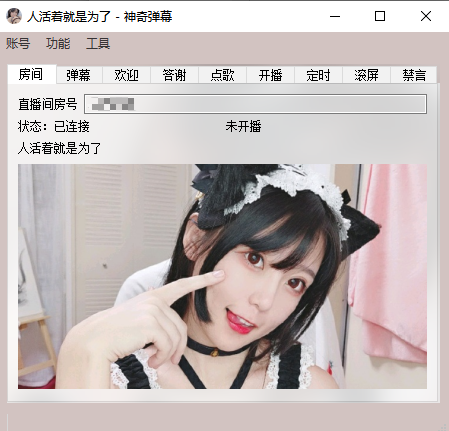

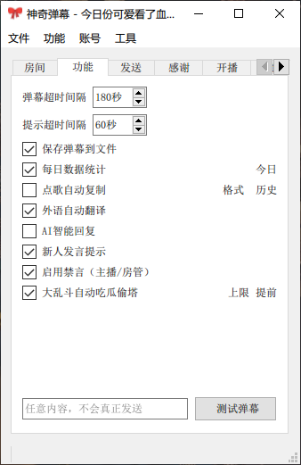

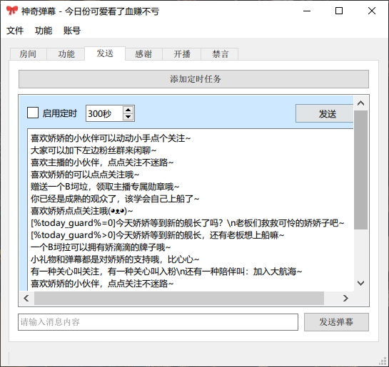

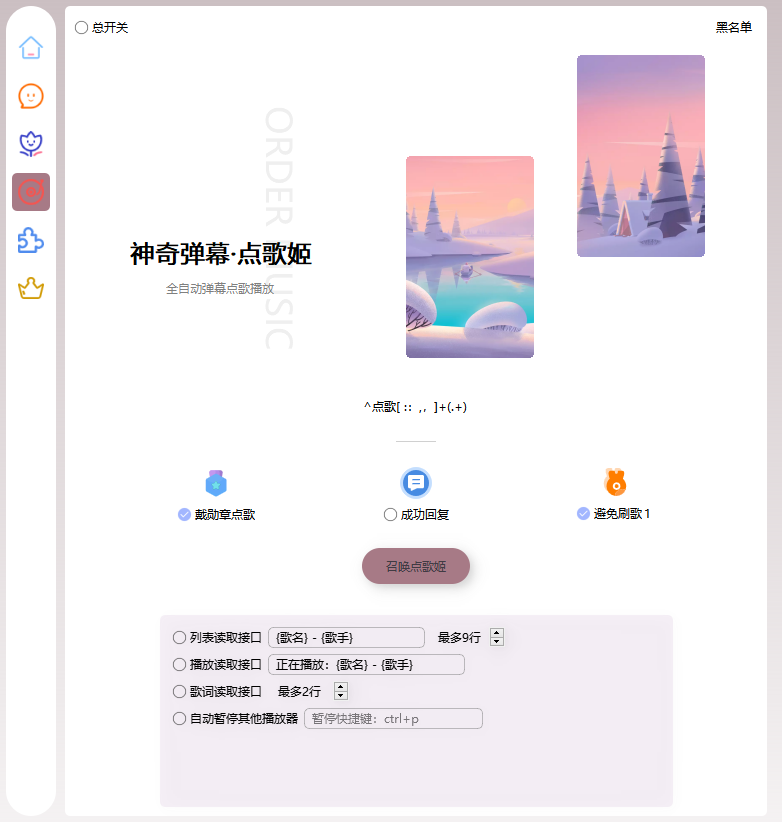

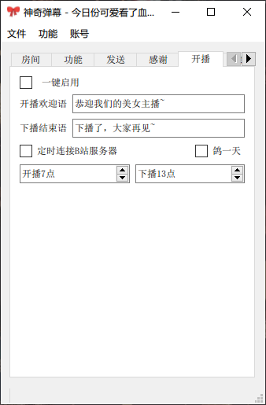

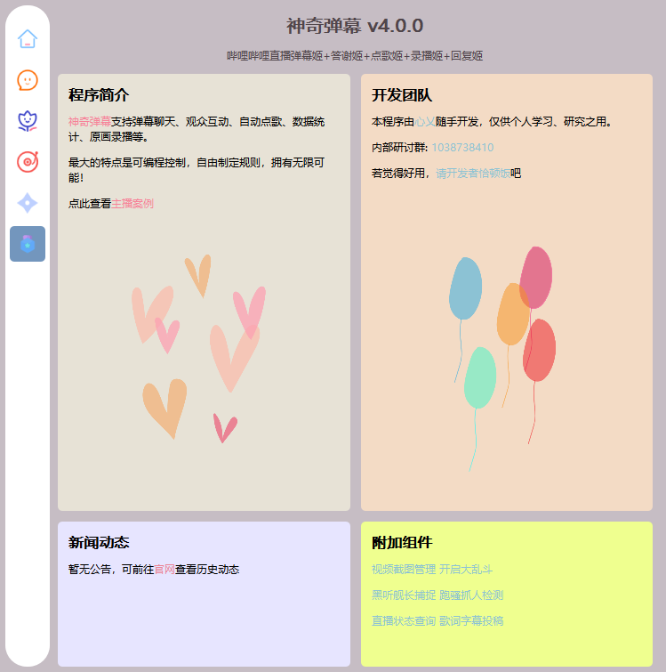

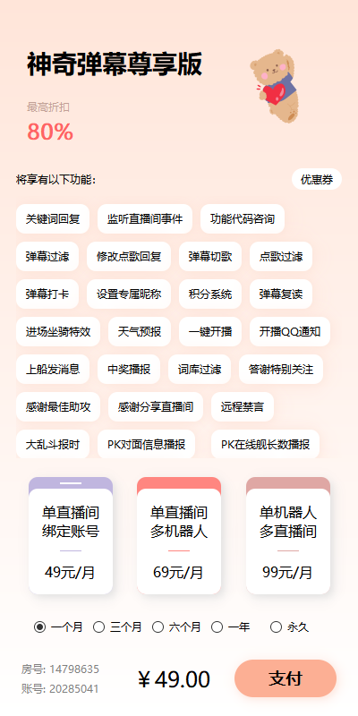

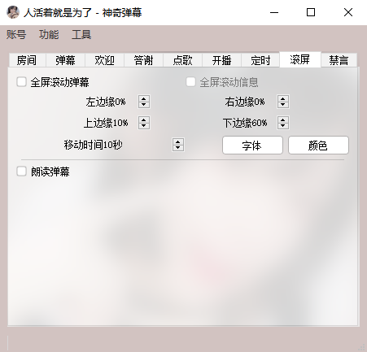

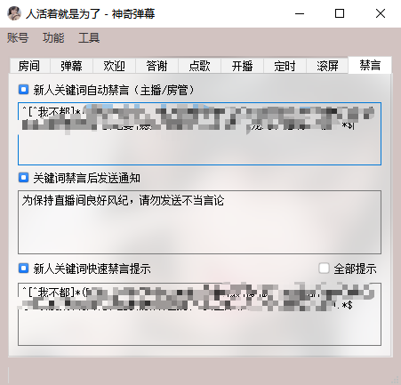


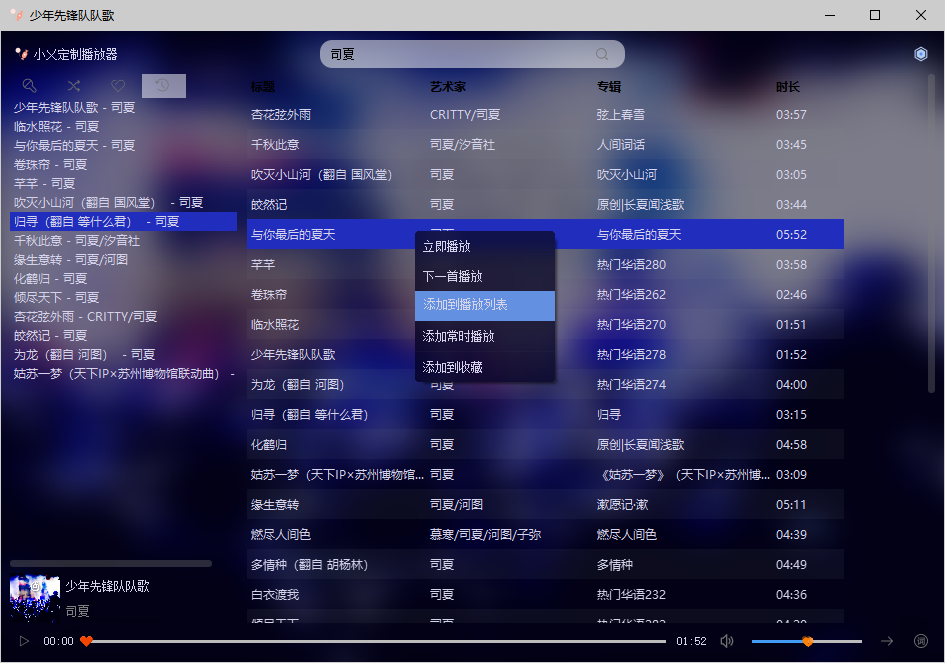

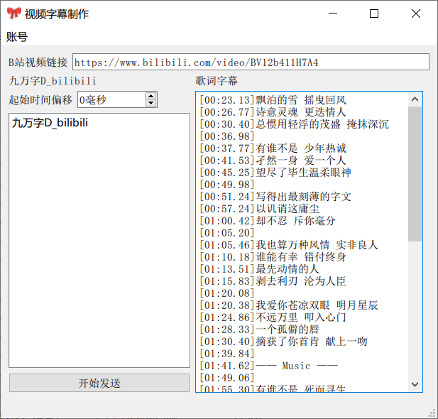


## 使用技巧

绿色版，开箱即用，输入房间号自动连接。

### 实时弹幕

实时弹幕支持如同聊天软件的水群小窗，`Shift+Alt+D`快速弹出（非隐藏时有效），ESC返回之前的程序

若是上班摸鱼，可以设置闲聊模式（仅显示弹幕）+简约模式（去头像、彩色），背景全透明，文字半透明灰色，不注意绝对很难看出来。


### 设置账号Cookie

懒，所以没有做登录功能，如果要发送弹幕，直接使用浏览器Cookie进行登录。

**方式一步骤**：

1. 浏览器上按`F12`打开【开发者工具】，Network - XHR
2. 进入或刷新[B站主页](https://www.bilibili.com/)（没登录的需登录），Name多了一排，点其中任意一个（若找不到Cookie就换个）
3. 复制如下图的cookie至菜单“账号”中的“设置Cookie”，即可进行发送。

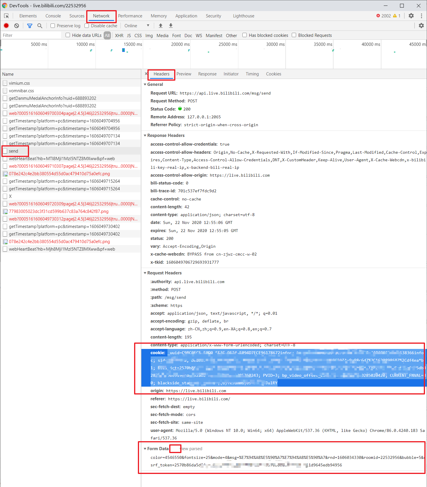

使用Cookie也是为了保证账号安全，当程序借给别人时，自己可以远程退出Bilibili账号，之后则需要重新cookie和data。

> 如果输入房间号后一直显示“获取房间信息...”，需先安装VC_redist：https://aka.ms/vs/15/release/vc_redist.x64.exe


### 欢迎弹幕

以下多项功能支持自定义弹幕、大量可编程变量，具体说明请参考下面的“[可编程变量与运算](#programing)”。

- 普通的欢迎：`%ai_name%，%greet%%tone/punc%`
  将发送：某某某，早上好啊~

- **未戴牌子**不欢迎，除非是舰长或强提醒：`[%guard% = 0, %anchor_roomid%!=%room_id%, !%strong_notify%]**`
  两个`*`表示优先级，覆盖没有`*`或1个`*`的弹幕，空弹幕表示不发送
- 欢迎**舰长**：`[%guard%]*欢迎舰长 %ai_name% 回家~`
- 一周至一个月没来：`[%come_time%>%timestamp%-3600*24*30, %come_time%<%timestamp%-3600*24*7, 0]*%ai_name%，太久没来了哦~`
- **大乱斗对面**来人：`[%pk_opposite%]***欢迎%ai_name%串门哦~`

### 送礼答谢

- 普通的答谢：`谢谢 %ai_name% 的%gift_name%~`
- **小礼物**不理：`[%gift_gold%=0, %gift_silver%<1000, %gift_num% < 10]**`
  也可以写作：`[%coin_type%=0, %gift_coin%<1000, %gift_num% < 10]**`
  1000以下的银瓜子礼物且数量小于10，则忽略。例如忽略6个小心心，但24个小心心则感谢
- **超过80元**的礼物：`[%gift_gold%>=80000]*哇噢！感谢 %ai_name% 的%gift_name%！\n老板大气！！！！！！`
  `\n`表示换行，将分作两条弹幕发送（可以配合`<h1>`放大字体，仅部分弹幕插件有效）

### 定时任务

##### 示例：今日是否有大航海

- `[%today_guard%=0]今天XX等到新的舰长了吗？\n老板们救救可怜的XX吧~`
- `[%today_guard%>0]今天XX等到了新的舰长，还有老板想上船嘛`

##### 示例：定时联网

如果想要定时向某个API发送数据，可通过定时任务结合`connectNet(url)`函数

```
>connectNet(要发送数据的网址)
```

<div id='programing'/>
## 可编程变量与运算

> 这一块比较专业，所以单独拎出来写教程。

弹幕的候选列表中，支持一系列的可编程变量、简单逻辑运算、简单算术运算。

使用两个 `%` 包括的英文，则为变量。数据变量例如 `%uname%`，与当前的一系列数据相关，例如礼物价值、今日人数等等；招呼变量例如 `%greet%`，自动替换为当前时间段对应的招呼语，例如候选项表达式 `%ai_name%，%greet%%tone/punc%`，在早上可能是“早上好啊，某某某”，在下午可能是“某某某，下午好~”，在晚上又会是“晚饭吃了吗，某某某~”。

示例：

- 简单的欢迎：`欢迎 %ai_name% 光临~`
- 动态语气词：`%ai_name%，%greet%%tone/punc%`

看下去，有更多例子。

### 计算变量

| 变量    | 描述               | 注意事项                               |
| ------- | ------------------ | -------------------------------------- |
| %{key}% | 获取配置文件中的值 | key为setValue(key)中的键值，未设置为空 |
| %[exp]% | 简单的数值计算     | 暂时只支持加减乘除，不支持括号、小数   |

##### 示例：礼物价值

```
谢谢%ai_name%赠送了价值%[%gift_gold%/1000]%元的%gift_name%！
```

### 数据变量

同上，都需要带上百分号，例如`%var%`，表格中皆省略。

| 变量             | 描述                     | 注意事项                                      |
| ---------------- | ------------------------ | --------------------------------------------- |
| uid              | 用户ID                   | 是一串数字，确定唯一用户                      |
| uname            | 用户名                   | 需要用户值，例如定时消息，则只是空字符串      |
| username         | 用户名                   | 和上面一模一样                                |
| nickname         | 用户名                   | 同上                                          |
| ai_name          | 用户智能昵称             | 优先专属昵称，其次简写昵称，无简写则用原昵称  |
| local_name       | 用户专属昵称             | 实时弹幕中右键-设置专属昵称                   |
| simple_name      | 用户简写昵称             | 去除前缀后缀各种字符                          |
| level            | 用户等级                 | 进入直播间没有level                           |
| text             | 当前弹幕消息             | 几乎用不到                                    |
| come_count       | 用户进来次数             |                                               |
| come_time        | 用户上次进来时间         | 第一次进来是0                                 |
| gift_gold        | 当前礼物金瓜子           | 非送礼答谢则没有                              |
| gift_silver      | 当前礼物银瓜子           |                                               |
| gift_coin        | 当前礼物价值(不分金银)   |                                               |
| coin_gold        | 是否是金瓜子礼物         | 金瓜子是1，银瓜子是0                          |
| gift_name        | 当前礼物名字             | 如果设置了别名，则使用别名                    |
| origin_gift_name | 原始礼物名字(非别名)     |                                               |
| gift_num         | 当前礼物数量             |                                               |
| gift_multi_num   | 带单位的礼物数量         | 如果为1个，则忽略，为空文本                   |
| guard_buy        | 是否为购买舰长的通知     | 没有瓜子，gift_name为舰长/提督/总督           |
| guard_frist      | 是否初次购买舰长         | 初次1，重新上船2，其余0                       |
| total_gold       | 用户总共金瓜子           | 该用户一直以来赠送的所有金瓜子数量            |
| total_silver     | 用户总共银瓜子           | 同上                                          |
| anchor_roomid    | 粉丝牌房间ID             | 进入、弹幕才有粉丝牌，送礼只能获取粉丝牌名字  |
| medal_name       | 粉丝牌名称               | 同上                                          |
| medal_level      | 粉丝牌等级               | 同上                                          |
| medal_up         | 粉丝牌UP主名称           | 只有弹幕消息有                                |
| nickname_len     | 昵称长度                 |                                               |
| giftname_len     | 礼物名字长度             |                                               |
| name_sum_len     | 昵称长度+礼物名字长度    |                                               |
| ainame_sum_len   | 短昵称长度+礼物名字长度  |                                               |
| new_attention    | 是否是新关注             | 最近50个关注内                                |
| guard_count      | 上船次数，可判断是否初次 | 舰长+1、提督+10、总督+100（只统计程序运行时） |
| pking            | 当前是否在大乱斗         | 是：1，否：0                                  |
| pk_room_id       | pk对面房间号             | 未在PK中则为空，下同                          |
| pk_uid           | pk对面主播ID             |                                               |
| pk_uname         | pk对面主播昵称           |                                               |
| pk_opposite      | pk对面进来               | 需开启串门提示                                |
| pk_view_return   | pk去对面串门并回来       | 需开启串门提示                                |
| pk_count         | pk次数                   | 未在PK中为0，下同                             |
| pk_touta_prob    | 对面偷塔概率百分比       | 数值部分，例如概率为50%，则为50。初次PK为0    |
| pk_my_votes      | 本次pk己方积分           |                                               |
| pk_match_votes   | 本次pk对方积分           |                                               |
| pk_ending        | 是否大乱斗快结束了       | 根据设置中的大乱斗【提前】值判断              |
| pk_trans_gold    | pk的1分等于多少金瓜子    | 按照设置来                                    |
| pk_max_gold      | pk最大偷塔金瓜子         |                                               |
| today_come       | 今日进来人次             | 每个人可能重复进入                            |
| today_newbie_msg | 今日新人人数             |                                               |
| today_danmaku    | 今日弹幕总数             |                                               |
| today_fans       | 今日新增粉丝数           |                                               |
| fans_count       | 当前总粉丝数             |                                               |
| today_gold       | 今日收到金瓜子总数       |                                               |
| today_silver     | 今日收到银瓜子总数       |                                               |
| today_guard      | 今日上船人次             | 续多个月算多次                                |
| admin            | 是否是房管               | 只有弹幕、进入才有                            |
| guard            | 舰长                     | 只有弹幕消息有；普通0，舰长3，提督2，总督1    |
| admin_or_guard   | 是否是房管或舰长         | 只有弹幕消息有，0或1                          |
| vip              | 是否是姥爷               | 同上                                          |
| svip             | 是否是年费姥爷           | 同上                                          |
| uidentity        | 是否是正式会员           | 同上                                          |
| iphone           | 是否手机号认证           | 同上                                          |
| time_hour        | 当前小时                 |                                               |
| time_minute      | 当前分钟                 |                                               |
| time_second      | 当前秒                   |                                               |
| time_day         | 当前日期                 |                                               |
| time_month       | 当前月份                 |                                               |
| time_year        | 当前年份                 |                                               |
| time_day_week    | 当前星期                 | 1~7                                           |
| time_day_year    | 当前一年中第几天         |                                               |
| timestamp        | 当前10位时间戳           | 可用于比较进入时间、多久没来等                |
| timestamp13      | 当前13位时间戳           |                                               |
| app_path         | 程序运行路径             |                                               |
| living           | 当前是否已开播           | 是：1，否：0                                  |
| room_id          | 直播间ID                 |                                               |
| room_name        | 直播间标题               |                                               |
| up_uid           | 主播UID                  |                                               |
| up_name          | 主播名字                 |                                               |
| my_uid           | 机器人UID                |                                               |
| my_uname         | 机器人名字               |                                               |
| care             | 特别关系                 | 是：1，否：0                                  |
| strong_notify    | 强提醒                   | 是：1，否：0                                  |
| not_welcome      | 不自动欢迎               | 不欢迎：1，欢迎：0                            |
| not_reply        | 不自动回复               | 不回复：1，回复：0                            |
| blocked          | 被禁言中                 | 禁言：1，未禁言0                              |

### 招呼变量

| 变量      | 描述           | 示例                                              |
| --------- | -------------- | ------------------------------------------------- |
| hour      | 时辰           | 早上/中午/下午/晚上                               |
| greet     | 招呼           | 您好、早上好、晚上好                              |
| all_greet | 带语气词的招呼 | 你好、早上好啊、午饭吃了吗、晚上好呀、怎么还没睡~ |
| tone      | 语气词         | “啊”或“呀”                                        |
| lela      | 语气词         | “了”或“啦”                                        |
| punc      | 标点           | “~”或“！”                                         |
| tone/punc | 语气词或标点   | 上面两项，适用于和%greet%结合                     |

### 四则运算

数字与数字、字符串与字符串之间可进行比较。其中运算符支持 `加+`、`减-`、`乘*`、`除/`(向下取整)、`取模%`、`包含~`，比较支持 `大于>`、`小于<`、`等于=`、`不等于!=`、`大于等于>=`、`小于等于<=`。

tips：

-  开发人员友好，`=` 可写作 `==`
-  不等于 `!=` 也可以是 `<>`
- 字符串两端可不用加双引号`"`

比较的两边，当都是数字或算数表达式时，自动进行简单的计算。

另外，仅支持在开头的`[]`判断中进行四则运算，**在弹幕内容中计算需要使用`%[公式]%`**！

### 逻辑运算

与编程语言相似的算法，每一行使用 `[]` 开头，则方括号中的内容会识别为`条件表达式`，使用 `,` 或 `&&` 来执行“与”逻辑，使用 `;` 或 `||` 来执行“或”逻辑；“或”的优先级更高。`[]` 中使用 `%val%` 作为变量值，例如 `[%level%>10]弹幕内容`，则只有当用户等级超过10级时才会被发送`弹幕内容`。

示例：

- 用户等级为0级：`[%level%=0]` 或 `[%level% == 0]`
- 粉丝牌等级介于10级到19级之间：`[%medal_level%>=10, %medal_level%<20]`
- 名字为某某某：`[%uname%=某某某]` 或 `["%nickname%"=="某某某"]`
- 现在是黑夜：`[%time_hour% > 17 || %time_hour% <= 6]`
- 带粉丝牌的0级号，或非0级号：`[%level%]`
- 付费两万（2千万金瓜子）的老板：`[%total_gold% >= 20000000]`
- 一小时内重新进入直播间：`[%come_time% > %timestamp%-3600]`
- 几周没来：`[%come_time%>%timestamp%-3600*24*30 &&  %come_time%<%timestamp%-3600*24*7]`

### 优先级覆盖

文本框中内容支持多行，一行为一条候选项，随机发送一条。其中每一条都可以用星号 `*` 开头（若有条件表达式 `[exp]`，则`*`位于表达式后面），星号数量越多，则优先级越高。高优先级候选应当带有条件，当满足条件时，发送该条弹幕，并无视掉所有更低优先级的候选。

带有优先级的候选项，会被更高优先级（更多星号）的候选项所覆盖。

例如：

```
感谢 %ai_name% 的%gift_name%，么么哒~
[%gift_gold%>=10000]感谢 %ai_name% 的%gift_name%，老板大气！
[%gift_gold%>=50000]*(cd15:3)哇塞！感谢 %ai_name% 的%gift_name%！\n老板大气！
[%gift_gold%>=150000]**(cd16:1)哇噢！感谢 %ai_name% 的%gift_name%！\n老板大气！！！！！！
```

注意星号，1、2无优先级，即使满足第2项的条件，也是随机发送前两项之一。3优先级超过1、2，因此当满足3的条件并且不满足4时，会发送第3项。而当4的条件满足时，其余更低优先级的候选项都被无视，只发送4。

另外，3、4加入了`冷却通道`，表示不使用默认的送礼冷却。以4为例，改为冷却1秒，相当于强制发送（B站限制，最快1秒）。

- 当本次礼物的金瓜子总价少于1万时，发送第一项；
- 当本次礼物的金瓜子总价小于5万时，随机发送第一项、第二项；
- 当本次礼物金瓜子总价介于5万到15万时，发送第三项；
- 当本次礼物金瓜子总价超过15万时，发送第四项。

### 多条弹幕

使用 `\n` 来分割过长弹幕，则会分多条弹幕发送，每次延时1.5s。通过此方式支持**执行多条命令**。

> 这是两个普通字符，并不是换行符。对于编程人员来说，相当于代码中两个反斜杠加字母n。

受于B站后台的限制，多条弹幕将调整为每隔1.5秒发送一次，数量无上限。

<div id='cd_channel'/>
### 冷却通道

>  `v2.9.0`版本新增

为实现不同条件使用不同的冷却时间，新增了”冷却通道“的规则——连续发送弹幕（例如自动欢迎）会有一定冷却时间，但有时候会想要强制发送（例如强制欢迎舰长），或者自定义部分冷却时间（例如在有人连刷小心心的时候，突然有人上船，应当想要立刻通知）。

在自定义弹幕的开头使用形如`(cd25:10)`的格式，表示`当前时间若在冷却通道25号的上次发送后10秒，则发送当前弹幕`，即满足其10秒的冷却时间，并不受其他自动弹幕的影响。

##### 示例：强制欢迎

每30秒欢迎一次用户；而若有25级及以上粉丝牌的用户进来，立刻欢迎，除非连续两个25级及以上的用户在5秒内进来，则只欢迎前一人；若是舰长，同上，多条冷却通道之间互不影响。而25级舰长，根据舰长优先级`**`超过25级优先级`*`，会优先发送欢迎舰长的弹幕。

```
(cd10:30)欢迎%ai_name%~
[%medal_level%>=25]*(cd11:5)欢迎%ai_name%，请多多关照~
[%guard%]**(cd12:5)欢迎舰长%ai_name%回家！
```

内置100个冷却通道，其中0~9已被系统使用，用户自定义建议为10~99，应该够用了。

>  注意：B站连续发送弹幕的冷却时间为1秒，与本程序的弹幕冷却系统无关。


### 函数操作

有一些自定义的函数，如下：

| 函数                              | 说明                                               |
| --------------------------------- | -------------------------------------------------- |
| abort()                           | 终止本流程后面弹幕                                 |
| block(uid, hour)                  | 禁言用户，`uid` 可使用参数 `%uid%` 获得            |
| block(uid)                        | 同上，默认使用自动禁言的时间                       |
| unblock(uid)                      | 解除禁言                                           |
| delay(msecond)                    | 延迟执行后面所有待执行的操作，单位毫秒             |
| addGameUser(uid)                  | 添加用户至游戏队列，使用`[%in_game_users%]`判断    |
| removeGameUser(uid)               | 从游戏队列中移除用户                               |
| sendGift(giftId, num)             | 赠送礼物，只支持 id 的方式                         |
| execRemoteCommand(cmd)            | 执行远程控制（见下面）                             |
| execRemoteCommand(cmd, 0)         | 执行远程控制，不发送回馈通知                       |
| sendPrivateMsg(uid, msg)          | 向指定用户发送私信                                 |
| sendRoomMsg(roomId, msg)          | 向指定直播间发送弹幕                               |
| timerShot(msecond, msg)           | 定时多少**毫秒**后发送弹幕msg（msg允许为另一函数） |
| locaNotify(msg)                   | 发送本地消息通知（非弹幕，只有自己看得到）         |
| localNotify(uid, msg)             | 同上，带用户ID                                     |
| speakText(msg)                    | 朗读文本                                           |
| openUrl(url)                      | 浏览器打开网址                                     |
| connectNet(url)                   | 后台连接网址（GET）                                |
| postData(url, data)               | 同上（POST）                                       |
| runCommandLine(cmd)               | 运行命令行                                         |
| setValue(key, val)                | 保存值到配置文件，通过%{key}%获取，重启后仍在      |
| openFile(path)                    | 打开文件                                           |
| playSound(path)                   | 播放音频文件                                       |
| improveSongOrder(username, order) | 点歌提前播放，order为提升的索引值                  |
| cutOrderSong(username)            | 切歌，仅限正在播放该用户自己点的歌时               |
| curOrderSong()                    | 立即切歌，无论是谁点的                             |
| messageBox(text)                  | 弹窗提示                                           |


在自动回复的每一条弹幕中使用符号 `>` 开头，紧接着 `func(arg...)` 格式，将执行本地函数，而不发送弹幕（若不是上述函数，将改为弹幕发送）。

> 注意：不支持一条弹幕同时操作多个命令，若有需要，可用用 `\n` 隔开
>

##### 示例：自动打卡

添加定时任务，设置时间为 `86400` （一天秒数）

添加发送的文本：

```
>sendRoomMsg([直播间房号], 打卡)
```

注意：需要**关闭“仅直播时发送”**

##### 示例：禁言小游戏

扣1禁言、关注主播或赠送小心心解除禁言（需要房管或主播）

**回复**中添加一栏，**关键词**为 `^1$`，**回复**：

```
已自动禁言，赠送小心心或关注主播解禁\n>block(%uid%, 1)\n>addGameUser(%uid%)
```

这里执行了三个操作：

1. 回复
2. 禁言
3. 添加到游戏用户，等待解除禁言

**答谢 — 感谢送礼**中添加：

```
[%in_game_users%,%origin_gift_name%=小心心]***已解除禁言\n>unblock(%uid%)\n>removeGameUser(%uid%)
```

> 其中 `[...]***` 中的星号为优先级，保证数量超过其余弹幕即可。
>
> `%in_game_users%` 确保是扣 `1` 被禁言（因为禁言的时候添加到了游戏用户）的，而非被手动禁言的用户

**答谢 — 感谢关注**中添加：

```
[%in_game_users%]*已解除禁言\n>unblock(%uid%)\n>removeGameUser(%uid%)
```

> 实测已关注的，先取关再马上重新关注，收不到通知，需要等会儿再关注

在两个答谢中，执行了三个操作：

1. 回复
2. 解除禁言
3. 从游戏用户中移除，后续小心心不再触发该游戏，而是普通的答谢

##### 示例：上船自动私信

**答谢 — 感谢送礼**中添加：

```
[%guard_buy%,!%guard_count%]感谢%ai_name%开通%gift_name%！\n>sendPrivateMsg(%uid%, 感谢开通大航海，可加入粉丝群：xxx)
```

`%guard_buy%` 判断是否是购买舰长的通知；`%guard_count%` 获取上船次数，为上过船为0，`!`为取反，于是可用 `!%guard_count%` 来增加第一次上船的条件。

> `%guard_count%` 只计算本程序时运行时购买舰长的用户，因此建议使用一个月后再开启该功能

##### 示例：送礼优先点歌

**答谢-感谢送礼**中添加：

```
[%gift_name%=喵娘]>improveSongOrder(%username%,5)
```

赠送一个喵娘则提前5首歌播放。可将`5`改为`999`表示无限大，或者用 `%gift_gold% / 1000` 表示每1000金瓜子礼物可提前一首歌，如下：

```
[%gift_name%=喵娘]>improveSongOrder(%username%,%[%gift_gold%/1000]%)
```

##### 示例：弹幕切歌

房管可以切所有歌，普通观众只能切自己点的歌

自动回复添加**表达式**：`^切歌$`

设置动作：

```
[%admin%]*>cutOrderSong()
>cutOrderSong(%username%)
```

### 远程控制

主播或者机器人账号在直播间内发送如`关闭欢迎`、`开启录播`等命令，可远程控制在服务器上的机器人（本地没必要使用远程命令）。

- 关闭/开启功能：开关自动欢迎、送礼答谢、关注答谢、自动禁言
- 关闭/开启欢迎
- 关闭/开启关注答谢
- 关闭/开启送礼答谢
- 关闭/开启禁言：新人关键词自动禁言
- 关闭/开启偷塔
- 关闭/开启点歌
- 关闭/开启点歌回复
- 关闭/开启定时任务
- 关闭/开启自动连接
- 关闭/开启弹幕回复：AI回复弹幕
- 关闭/开启录播
- 禁言 [昵称] [小时]：房管权限，根据[昵称]（允许一部分，自动倒找发言人）禁言某用户，[小时]可省略，默认为自动禁言的时长
- 解禁 [昵称]：解除禁言，[昵称]支持用户名中的一部分
- 撤销禁言：依次解禁最近禁言的用户
- 永久禁言 [昵称]：永久禁言某用户，可通过“解禁 [昵称]”、“撤销禁言”远程解除
- 关闭机器人：全局关闭（将无法远程唤醒）


### 事件动作

收到服务器CMD消息、一些程序的运行状态的改变，都会触发本程序中的“事件”。

部分数据可直接用 `%uid%`、`%uname%` 等变量获得，部分CMD未读取数据，返回为空。

大部分CMD等同于B站后台CMD，也有一些是自创的。可用事件CMD如下：

#### 主程序事件

| 事件命令 | 说明     |
| -------- | -------- |
| START_UP | 程序启动 |

#### 点歌姬事件

`%uname%`用户，`%text%`歌名

| 事件命令                    | 说明                              |
| --------------------------- | --------------------------------- |
| ORDER_SONG_SUCCEED          | 点歌成功                          |
| ORDER_SONG_PLAY             | 开始播放                          |
| ORDER_SONG_FREQUENCY        | 点歌过于频繁                      |
| ORDER_SONG_NO_MEDAL         | 点歌未戴勋章                      |
| ~~ORDER_SONG_NO_COPYRIGHT~~ | ~~歌曲无版权~~（自动切换）        |
| ORDER_SONG_COPY             | 点歌已复制歌名                    |
| ORDER_SONG_IMPROVED         | 提前播放                          |
| ORDER_SONG_CUTTED           | 被手动切歌，即调用`>cutOrderSong` |

##### 示例：点歌提示未带勋章

添加事件：`ORDER_SONG_NO_MEDAL`，动作：

```
(cd35:600)请戴粉丝牌点歌
```

加了**冷却通道**，最多十分钟提醒一次。

#### 弹幕姬事件

其中加粗事件表示程序中默认已用上（允许重复使用），并且能获得详细用户ID、昵称、粉丝勋章等信息。

未加粗事件则只是接收数据，未进行解析。

| 事件命令                      | 说明                                                         |
| ----------------------------- | ------------------------------------------------------------ |
| **LIVE**                      | 开播【欢迎语】                                               |
| **PREPARING**                 | 下播【结束语】                                               |
| ROOM_CHANGE                   | 房间信息改变                                                 |
| ROOM_RANK                     | 排名改变                                                     |
| **DANMU_MSG**                 | 接收到弹幕【自动回复】                                       |
| **SEND_GIFT**                 | 有人送礼【答谢送礼】                                         |
| WELCOME_GUARD                 | 舰长进入（不会触发）                                         |
| **ENTRY_EFFECT**              | 舰长、热门榜、老爷进入【欢迎舰长】                           |
| WELCOME                       | 老爷进入                                                     |
| **INTERACT_WORD**             | 用户进入【欢迎】                                             |
| **ATTENTION**                 | 用户关注【答谢关注】                                         |
| **SHARE**                     | 用户分享直播间                                               |
| ROOM_REAL_TIME_MESSAGE_UPDATE | 粉丝数量改变                                                 |
| SUPER_CHAT_MESSAGE            | 醒目留言                                                     |
| SUPER_CHAT_MESSAGE_JPN        | 醒目留言日文翻译                                             |
| SUPER_CHAT_MESSAGE_DELETE     | 删除醒目留言                                                 |
| SPECIAL_GIFT                  | 节奏风暴                                                     |
| **ROOM_BLOCK_MSG**            | 用户被禁言，%uname%昵称                                      |
| PK_BATTLE_PRE                 | 大乱斗准备，10秒后开始                                       |
| PK_BATTLE_SETTLE              |                                                              |
| PK_BATTLE_START               | 大乱斗开始                                                   |
| PK_BATTLE_PROCESS             | 大乱斗双方送礼                                               |
| PK_BATTLE_END                 | 大乱斗结束                                                   |
| PK_BATTLE_SETTLE_USER         |                                                              |
| PK_BATTLE_SETTLE_V2           |                                                              |
| PK_LOTTERY_START              | 大乱斗胜利后的抽奖                                           |
| **PK_BEST_UNAME**             | PK最佳助攻，%uname%昵称；%level%:2赢,0平,-1输；%gift_coin%总积分(=金瓜子/100) |
| **CALL_ON_OPPOSITE**          | 本直播间的观众跑去对面串门                                   |
| **ATTENTION_OPPOSITE**        | 本直播间观众关注了对面主播                                   |
| **SHARE_OPPOSITE**            | 本直播间观众分享了对面直播间                                 |
| **ATTENTION_ON_OPPOSITE**     | 对面观众关注了本直播间                                       |
| **GUARD_BUY**                 | 有人上船                                                     |
| FIRST_GUARD                   | 用户初次上船                                                 |
| USER_TOAST_MSG                | 上船附带的通知                                               |
| HOT_RANK_CHANGED              | 热门榜排名改变                                               |
| HOT_RANK_SETTLEMENT           | 荣登热门榜topX                                               |
| ONLINE_RANK_V2                | 礼物榜（高能榜）刷新                                         |
| ONLINE_RANK_TOP3              | 高能榜TOP3改变                                               |
| ONLINE_RANK_COUNT             | 高能榜改变                                                   |
| NOTICE_MSG                    | 上船等带的通知                                               |
| COMBO_SEND                    | 礼物连击                                                     |
| SPECIAL_GIFT                  | 定制的专属礼物                                               |
| ANCHOR_LOT_CHECKSTATUS        | 天选时刻前的审核                                             |
| ANCHOR_LOT_START              | 开启天选                                                     |
| ANCHOR_LOT_END                | 天选结束                                                     |
| ANCHOR_LOT_AWARD              | 天选结果推送                                                 |
| VOICE_JOIN_ROOM_COUNT_INFO    | 申请连麦队列变化                                             |
| VOICE_JOIN_LIST               | 连麦申请、取消连麦申请                                       |
| VOICE_JOIN_STATUS             | 开始连麦、结束连麦                                           |
| WARNING                       | 被警告，`%text%`可获取内容                                   |
| room_admin_entrance           | 设置房管                                                     |
| ROOM_ADMINS                   | 房管数量改变                                                 |

> 考虑到发送弹幕的限制，如果同一个事件添加多个响应的动作，那么会按队列顺序执行，而不会同时一口气执行完。
>
> 并且有冷却（默认2秒左右），可以在开头加上冷却通道例如`(cd78:0)`消除冷却
>
> 另外，需注意`PREPARE`，若开启了“仅直播时回复”，那么任意动作（包括弹幕、函数等）将不会执行，可在下播结束语中操作

##### 示例：QQ群推送开播消息

以酷推为例：https://cp.xuthus.cc，按其说明配置

添加事件：`LIVE`，动作：

```
>connectNet(https://push.xuthus.cc/group/[skey]?c=[开播消息])
```

其中`[skey]`为您的酷推Skey，`[开播消息]`按服务格式自定义

一切配置妥当，开播时将会自动发送消息至QQ群


##### 示例：大乱斗结束前提醒

大乱斗结束前30秒提醒：一次大乱斗为5分钟，开始后4分半发送弹幕，270秒=270000毫秒。

添加事件：`PK_BATTLE_START`，动作：

```
>timerShot(270000, 离大乱斗结束还有30秒)
```


##### 示例：大乱斗最佳助攻

添加事件：`PK_BEST_UNAME`，动作：

```
[%level%=2, %gift_coin% >= 100]感谢本场最佳助攻：%uname%
```

仅当赢了，并且本次累计送礼有超过100积分（10000金瓜子）才感谢


##### 示例：上船声音提示

添加事件：`GUARD_BUY`，动作：

```
>playSound(%app_path%/audios/guard.mp3)
```

有人上船则自动播放`安装目录/audios/guard.mp3`，本程序不自带，需要自己找音频文件放上去。也可以是安装目录之外的绝对路径。


##### 示例：下播自动关机

下播30秒后电脑自动关机

添加下播事件：`PREPARE`，动作：

```
>timerShot(30000, >runCommandLine(shutdown -s -t 30))
```

添加开播事件：`LIVE`，动作：

```
>runCommandLine(shutdown -a)
```

多了延时30秒和响应开播事件，是排除主播意外掉线的情况。


## 附：弹幕CMD列表

根据字节流中的`protocol`，等于 `2` 时body部分需要用`zlib.uncompress`解压，常见CMD如下：

```C++
"ROOM_ADMINS" //房管列表
"room_admin_entrance"
"ONLINE_RANK_TOP3"
"ONLINE_RANK_COUNT"
"ONLINE_RANK_V2"
"TRADING_SCORE" //每日任务
"MATCH_ROOM_CONF" //赛事房间配置
"HOT_ROOM_NOTIFY" //热点房间
"MATCH_TEAM_GIFT_RANK" //赛事人气比拼
"ACTIVITY_MATCH_GIFT" //赛事礼物
"PK_BATTLE_PRE" //人气pk
"PK_BATTLE_START" //人气pk
"PK_BATTLE_PROCESS" //人气pk
"PK_BATTLE_END" //人气pk
"PK_BATTLE_RANK_CHANGE" //人气pk
"PK_BATTLE_SETTLE_USER" //人气pk
"PK_BATTLE_SETTLE_V2" //人气pk
"PK_BATTLE_SETTLE" //人气pk
"SYS_MSG" //系统消息
"ROOM_SKIN_MSG"
"GUARD_ACHIEVEMENT_ROOM"
"ANCHOR_LOT_START" //天选之人开始
"ANCHOR_LOT_CHECKSTATUS"
"ANCHOR_LOT_END" //天选之人结束
"ANCHOR_LOT_AWARD" //天选之人获奖
"COMBO_SEND"
"INTERACT_WORD"
"ACTIVITY_BANNER_UPDATE_V2"
"NOTICE_MSG"
"ROOM_BANNER"
"ONLINERANK"
"WELCOME"
"HOUR_RANK_AWARDS"
"ROOM_RANK"
"ROOM_SHIELD"
"USER_TOAST_MSG" //大航海购买信息
"WIN_ACTIVITY" //活动
"SPECIAL_GIFT" //节奏风暴
"GUARD_BUY" / //大航海购买
"WELCOME_GUARD" //大航海进入
"DANMU_MSG" //弹幕
"ROOM_CHANGE" //房间信息分区改变
"ROOM_SILENT_OFF" //禁言结束
"ROOM_SILENT_ON" //禁言开始
"SEND_GIFT" //礼物
"ROOM_BLOCK_MSG" //封禁
"PREPARING" //下播
"LIVE" //开播
"SUPER_CHAT_ENTRANCE" //SC入口
"SUPER_CHAT_MESSAGE_DELETE" //SC删除
"SUPER_CHAT_MESSAGE" //SC
"SUPER_CHAT_MESSAGE_JPN" //SC
"PANEL" //排行榜
"ENTRY_EFFECT" / //进入特效
"ROOM_REAL_TIME_MESSAGE_UPDATE" / //粉丝数
```


> 参考资料：
>
> - B站API列表：https://github.com/SocialSisterYi/bilibili-API-collect
> - 直播WS信息流：https://github.com/SocialSisterYi/bilibili-API-collect/blob/master/live/message_stream.md
> - 直播数据包解析：https://segmentfault.com/a/1190000017328813?utm_source=tag-newest
> - 部分CMD包分析：https://github.com/czp3009/bilibili-api/tree/master/record/%E7%9B%B4%E6%92%AD%E5%BC%B9%E5%B9%95
> - Qt解压zlib：https://blog.csdn.net/doujianyoutiao/article/details/106236207
> - 实时关注：https://github.com/BanqiJane/Bilibili_Danmuji
> - 点歌姬网易云源：https://github.com/Binaryify/NeteaseCloudMusicApi
> - 点歌姬QQ音乐源：https://github.com/rain120/qq-music-api
> - Star图标：https://www.behance.net/gallery/83133509/Logo-animations-collaboration
> - 跨播功能：https://github.com/nikhilm/qhttpserver


